# Ticketer Architecture Documentation

## Table of Contents
1. [System Overview](#system-overview)
2. [Microservices Architecture](#microservices-architecture)
3. [Technology Stack](#technology-stack)
4. [Service Communication](#service-communication)
5. [Data Architecture](#data-architecture)
6. [Message Flow](#message-flow)
7. [Deployment Architecture](#deployment-architecture)
8. [Security Architecture](#security-architecture)
9. [Observability](#observability)
10. [Scalability and Performance](#scalability-and-performance)

## System Overview

Ticketer is a comprehensive event ticketing platform built using a microservices architecture. The system enables event organizers to create and manage events, while providing customers with a seamless ticket purchasing experience.

### Core Business Capabilities
- **Event Management**: Create, publish, and manage events
- **User Authentication**: Secure user registration and login
- **Ticket Management**: Create, reserve, and track tickets
- **Booking System**: Handle complex booking workflows with saga pattern
- **Payment Processing**: Secure payment transactions
- **Notifications**: Multi-channel communication system
- **API Gateway**: Unified access point for all services

### High-Level Architecture

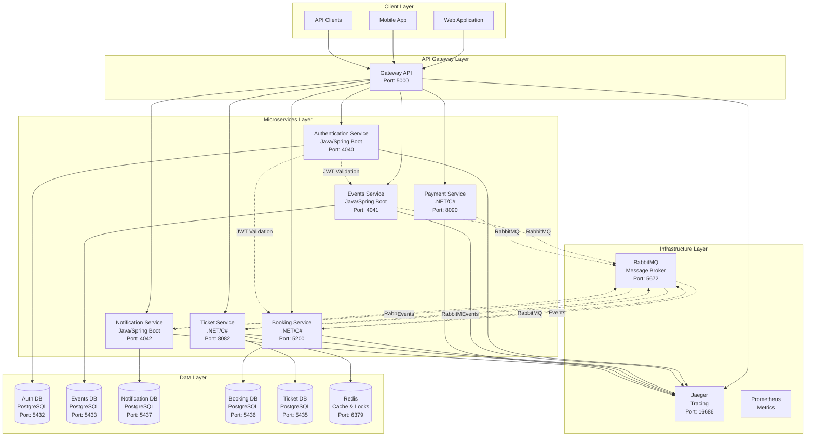

## Microservices Architecture

### Service Boundaries

The system is decomposed into seven core microservices, each with clear responsibilities and data ownership:

#### 1. Authentication Service (Java/Spring Boot)
- **Port**: 4040
- **Database**: PostgreSQL (Port: 5432)
- **Responsibilities**:
  - User registration and authentication
  - JWT token generation and validation
  - User profile management
  - Role-based access control

#### 2. Events Service (Java/Spring Boot)
- **Port**: 4041
- **Database**: PostgreSQL (Port: 5433)
- **Responsibilities**:
  - Event lifecycle management (create, update, publish, cancel)
  - Event catalog and search
  - Event metadata management
  - Organizer-specific operations

#### 3. Notification Service (Java/Spring Boot)
- **Port**: 4042
- **Database**: PostgreSQL (Port: 5437)
- **Responsibilities**:
  - Multi-channel notification delivery (Email, SMS, Push)
  - Template management
  - Event-driven notification processing
  - Delivery tracking and retry logic

#### 4. Booking Service (.NET/C#)
- **Port**: 5200
- **Database**: PostgreSQL (Port: 5436) + MongoDB (for booking data)
- **Responsibilities**:
  - Booking workflow orchestration using Saga pattern
  - Distributed transaction coordination
  - Booking state management
  - Integration with Ticket and Payment services

#### 5. Ticket Service (.NET/C#)
- **Port**: 8082
- **Database**: PostgreSQL (Port: 5435)
- **Cache**: Redis (Port: 6379)
- **Responsibilities**:
  - Ticket inventory management
  - High-concurrency ticket operations with distributed locking
  - Ticket status lifecycle management
  - Bulk ticket operations

#### 6. Payment Service (.NET/C#)
- **Port**: 8090
- **Database**: Stateless (no persistent storage)
- **Responsibilities**:
  - Payment processing with external gateways
  - Payment method management
  - Transaction security and compliance
  - Saga participation for booking workflow

#### 7. Gateway API (.NET/C#)
- **Port**: 5000
- **Responsibilities**:
  - Reverse proxy and request routing
  - Service discovery and health monitoring
  - Unified API documentation
  - Cross-cutting concerns (CORS, rate limiting, observability)

## Technology Stack

### Programming Languages and Frameworks

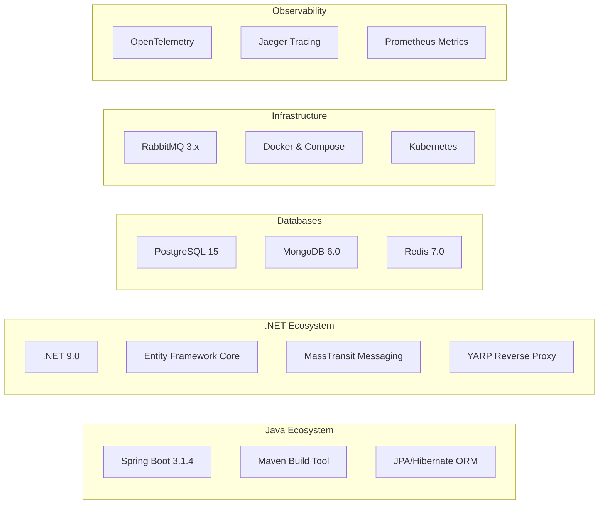

### Core Technologies by Category

#### **Backend Frameworks**
- **Java Services**: Spring Boot 3.1.4 with Java 21
- **.NET Services**: .NET 9.0 with C#
- **Build Tools**: Maven (Java), MSBuild (.NET)

#### **Databases**
- **Primary**: PostgreSQL 15 (one database per service)
- **Document Store**: MongoDB (Booking Service - booking data)
- **Cache/Locks**: Redis 7.0 (distributed locking, caching)

#### **Messaging**
- **Message Broker**: RabbitMQ 3.x
- **Java Integration**: Spring AMQP
- **.NET Integration**: MassTransit 8.5.2

#### **API Gateway**
- **Reverse Proxy**: YARP (Yet Another Reverse Proxy)
- **Documentation**: Unified Swagger/OpenAPI

#### **Observability**
- **Tracing**: OpenTelemetry + Jaeger
- **Metrics**: Prometheus + Micrometer
- **Logging**: Structured JSON logging

## Service Communication

### Communication Patterns

The system employs three primary communication patterns:

#### 1. Synchronous Communication (HTTP/REST)
Used for direct request-response interactions:

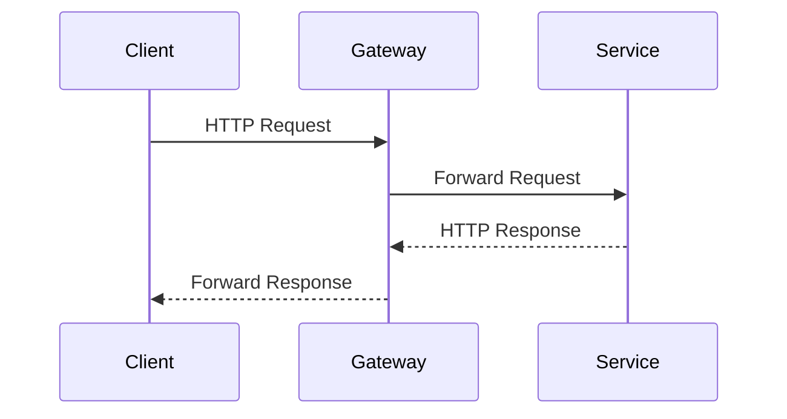

**Use Cases**:
- Client-to-service communication via Gateway
- Service-to-service authentication validation
- Real-time data queries

#### 2. Asynchronous Messaging (RabbitMQ)
Used for event-driven communication and loose coupling:

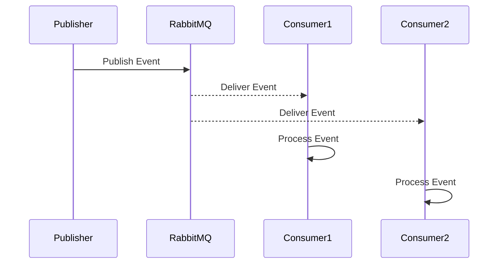

**Use Cases**:
- Event notifications (event created, updated, cancelled)
- Booking workflow coordination
- Notification delivery
- Ticket operations

#### 3. Saga Pattern (Distributed Transactions)
Used for managing complex business transactions across services:

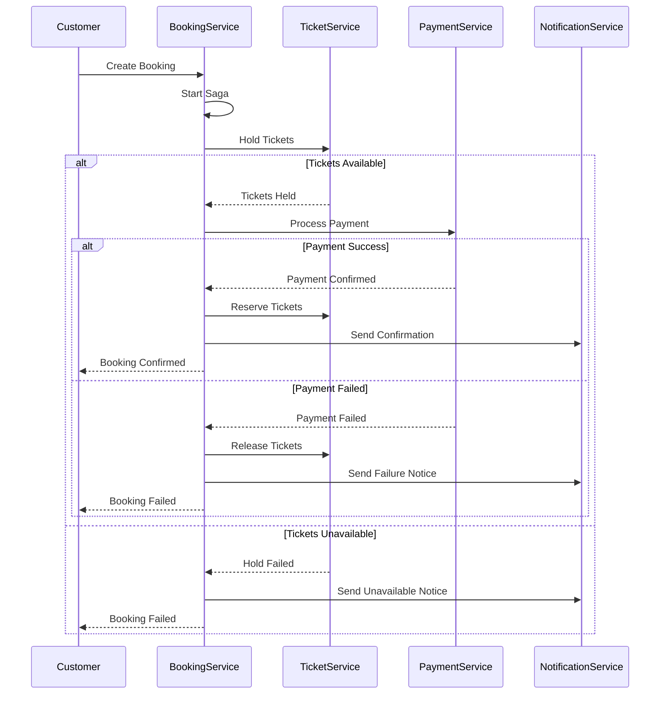

### Message Routing and Queues

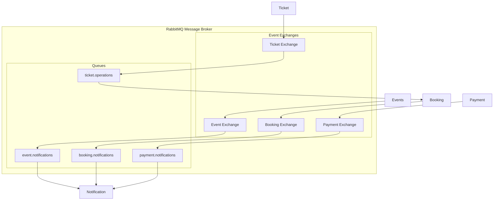

## Data Architecture

### Database-Per-Service Pattern

Each microservice owns its data and database:

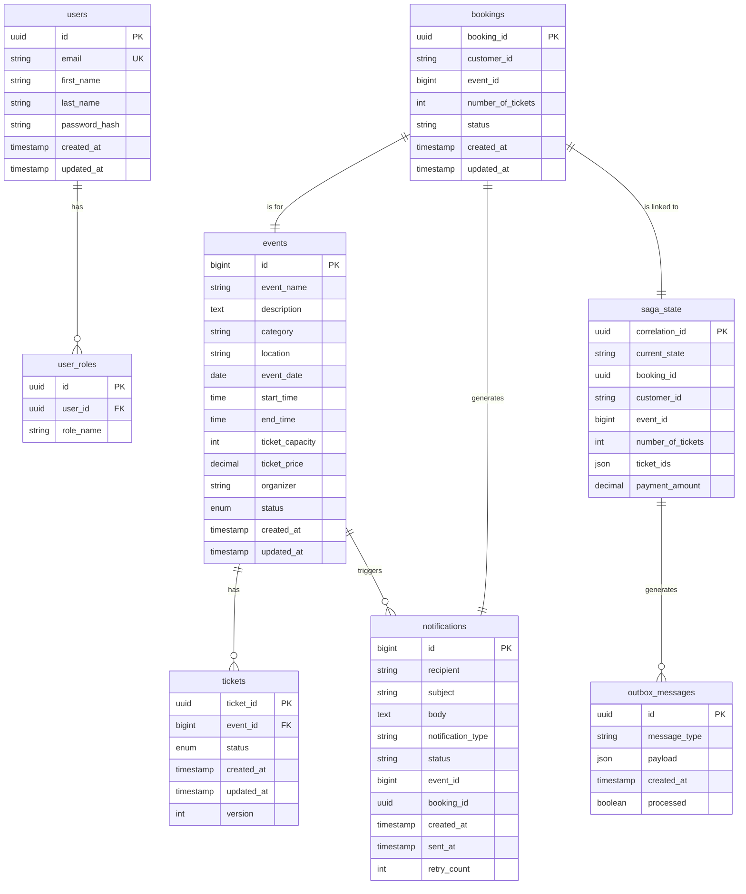

### Data Consistency Strategies

#### 1. Strong Consistency (Within Service)
- ACID transactions within each service's database
- Optimistic locking for concurrent operations (Ticket Service)
- Database constraints and foreign keys

#### 2. Eventual Consistency (Across Services)
- Saga pattern for distributed transactions
- Event sourcing for audit trails
- Compensating transactions for rollbacks

#### 3. Cache Strategy
- Redis for distributed locking (Ticket Service)
- Application-level caching for frequent queries
- Cache invalidation through messaging events

## Message Flow

### Event-Driven Architecture Flow

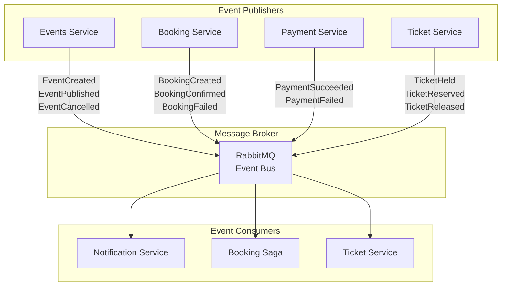

### Typical User Journey Flow

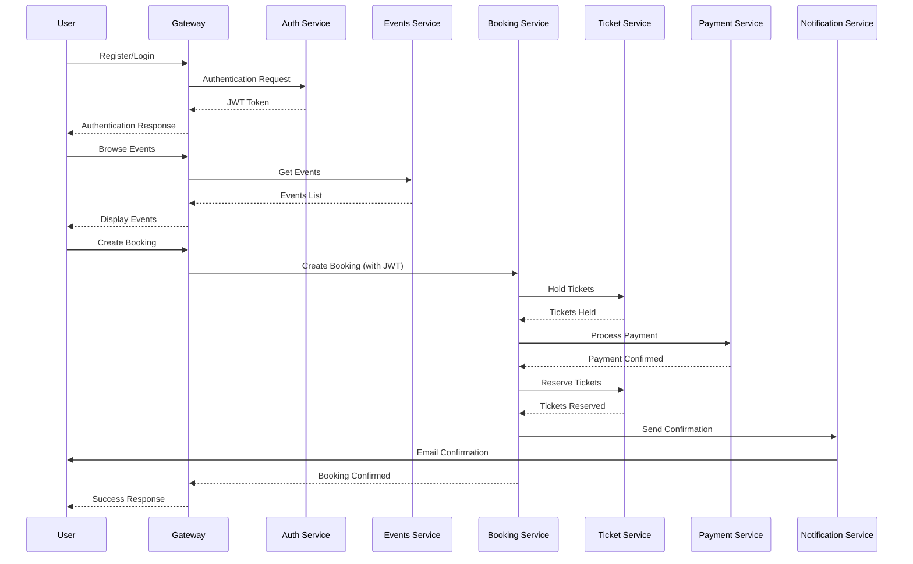

## Deployment Architecture

### Docker Containerization

Each service is containerized for consistent deployment:

```mermaid
graph TB
    subgraph "Docker Containers"
        subgraph "Java Services"
            AuthContainer[auth-service:latest<br/>OpenJDK 21]
            EventsContainer[events-service:latest<br/>OpenJDK 21]
            NotificationContainer[notification-service:latest<br/>OpenJDK 21]
        end
        
        subgraph ".NET Services"
            BookingContainer[booking-service:latest<br/>.NET 9.0 Runtime]
            TicketContainer[ticket-service:latest<br/>.NET 9.0 Runtime]
            PaymentContainer[payment-service:latest<br/>.NET 9.0 Runtime]
            GatewayContainer[gateway-api:latest<br/>.NET 9.0 Runtime]
        end
        
        subgraph "Infrastructure"
            PostgreSQLContainer[postgres:15]
            MongoDBContainer[mongo:6.0]
            RedisContainer[redis:7-alpine]
            RabbitMQContainer[rabbitmq:3-management]
            JaegerContainer[jaegertracing/all-in-one]
        end
    end
    
    subgraph "Networks"
        TicketerNetwork[ticketer-network<br/>Bridge Network]
    end
    
    AuthContainer --- TicketerNetwork
    EventsContainer --- TicketerNetwork
    NotificationContainer --- TicketerNetwork
    BookingContainer --- TicketerNetwork
    TicketContainer --- TicketerNetwork
    PaymentContainer --- TicketerNetwork
    GatewayContainer --- TicketerNetwork
    PostgreSQLContainer --- TicketerNetwork
    RedisContainer --- TicketerNetwork
    RabbitMQContainer --- TicketerNetwork
    JaegerContainer --- TicketerNetwork
```

### Docker Compose Architecture

```yaml
# Simplified docker-compose.yml structure
version: '3.8'

services:
  # API Gateway
  apigateway:
    image: ticketer/gateway-api
    ports: ["5000:80"]
    depends_on: [bookingservice, ticketservice, paymentservice]
  
  # .NET Services
  bookingservice:
    image: ticketer/booking-service
    ports: ["5200:80"]
    depends_on: [bookingservice-db, rabbitmq]
  
  ticketservice:
    image: ticketer/ticket-service  
    ports: ["8082:80"]
    depends_on: [ticketservice-db, redis, rabbitmq]
  
  paymentservice:
    image: ticketer/payment-service
    ports: ["8090:8090"]
    depends_on: [rabbitmq]
  
  # Java Services
  auth-service:
    image: ticketer/auth-service
    ports: ["4040:4040"]
    depends_on: [auth-db]
  
  events-service:
    image: ticketer/events-service
    ports: ["4041:4041"]
    depends_on: [events-db, rabbitmq]
  
  notification-service:
    image: ticketer/notification-service
    ports: ["4042:4042"]
    depends_on: [notification-db, rabbitmq]

networks:
  ticketer-network:
    driver: bridge
```

### Kubernetes Deployment (Production)

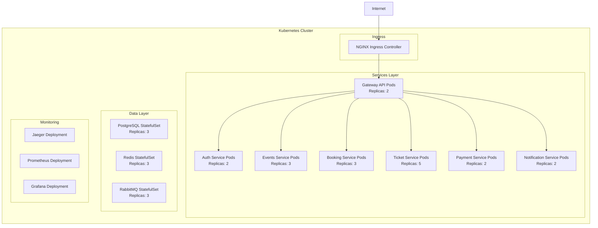

## Security Architecture

### Authentication and Authorization Flow

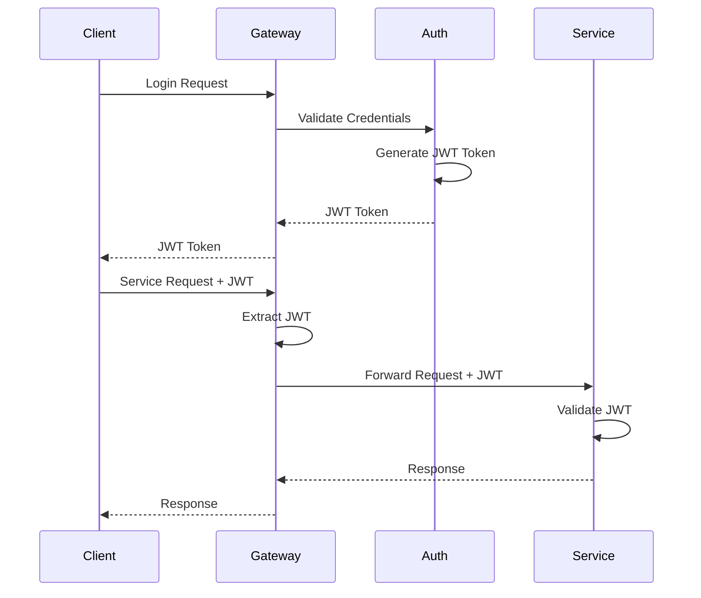

### Security Layers

#### 1. API Gateway Security
- **CORS Policy**: Configurable cross-origin resource sharing
- **Rate Limiting**: Request throttling per client
- **IP Filtering**: Allow/deny specific IP ranges
- **HTTPS Enforcement**: Redirect HTTP to HTTPS

#### 2. Service-Level Security
- **JWT Validation**: Stateless token validation
- **Role-Based Access Control**: ORGANIZER, CUSTOMER roles
- **Input Validation**: Request payload validation
- **SQL Injection Protection**: Parameterized queries

#### 3. Data Security
- **Encryption at Rest**: Database encryption
- **Encryption in Transit**: TLS/HTTPS communication
- **Password Hashing**: BCrypt with salt
- **Secret Management**: Environment variable injection

#### 4. Infrastructure Security
- **Network Isolation**: Docker network segmentation
- **Database Access Control**: Service-specific database users
- **Message Queue Security**: RabbitMQ user authentication
- **Container Security**: Non-root user execution

### Security Configuration Example

```yaml
# Security configuration patterns
security:
  jwt:
    secret: ${JWT_SECRET}
    expiration: 86400000 # 24 hours
  
  cors:
    allowed-origins:
      - "https://ticketer.com"
      - "https://app.ticketer.com"
  
  rate-limiting:
    requests-per-minute: 60
    burst-capacity: 10
```

## Observability

### Three Pillars of Observability

#### 1. Distributed Tracing (Jaeger)
Tracks requests across service boundaries:

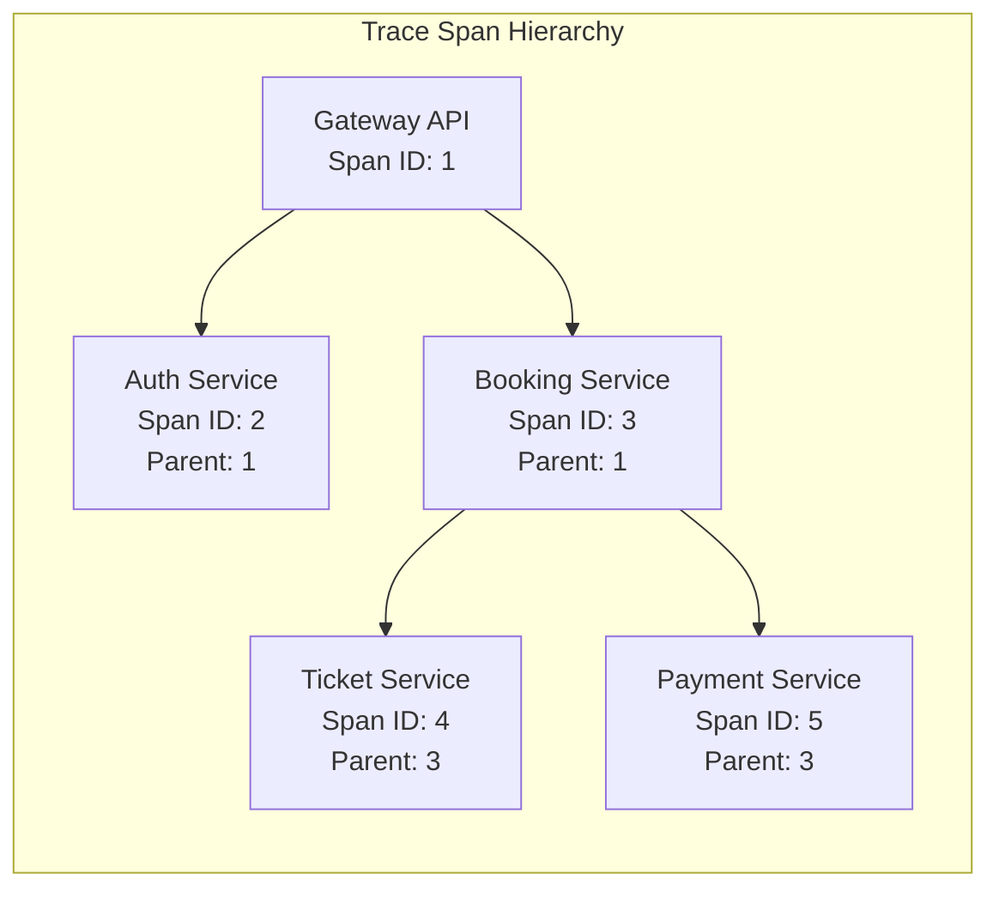

#### 2. Metrics Collection (Prometheus)
Key metrics across all services:

**Application Metrics**:
- Request rate (requests/second)
- Response time (latency percentiles)
- Error rate (4xx, 5xx responses)
- Active connections

**Business Metrics**:
- Booking conversion rate
- Payment success rate
- Ticket reservation success rate
- Event creation rate

**Infrastructure Metrics**:
- CPU and memory usage
- Database connection pools
- Message queue depth
- Cache hit/miss ratios

#### 3. Structured Logging
JSON-formatted logs with correlation IDs:

```json
{
  "timestamp": "2024-01-01T12:00:00Z",
  "level": "INFO",
  "service": "booking-service",
  "traceId": "abc123def456",
  "spanId": "789ghi012",
  "message": "Booking created successfully",
  "bookingId": "booking-123",
  "customerId": "customer-456",
  "eventId": 789
}
```

### Monitoring Dashboard Architecture

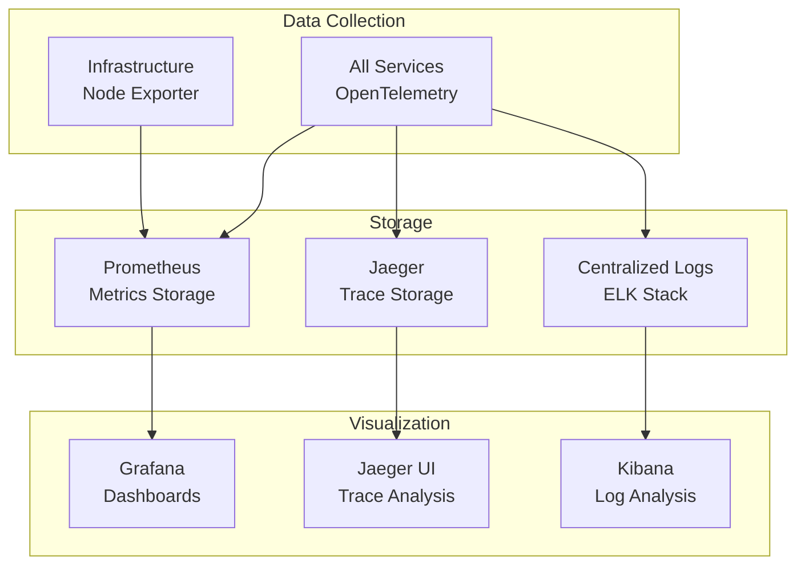

## Scalability and Performance

### Horizontal Scaling Strategy

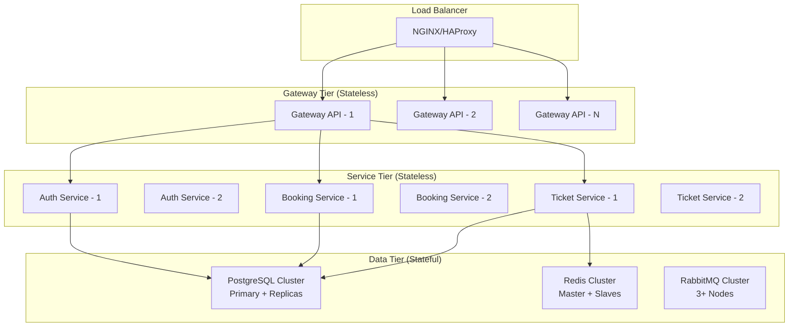

### Performance Optimization Techniques

#### 1. Database Optimization
- **Connection Pooling**: Optimized pool sizes per service
- **Read Replicas**: Separate read/write workloads
- **Indexing Strategy**: Strategic database indexes
- **Query Optimization**: Efficient query patterns

#### 2. Caching Strategy
- **Application Cache**: In-memory caching for frequent queries
- **Distributed Cache**: Redis for shared cache across instances
- **HTTP Cache**: Gateway-level response caching
- **Database Query Cache**: PostgreSQL query result caching

#### 3. Concurrency Handling
- **Distributed Locking**: Redis-based locks for ticket operations
- **Optimistic Locking**: Version-based concurrency control
- **Async Processing**: Non-blocking I/O operations
- **Circuit Breaker**: Fail-fast for unhealthy services

#### 4. Message Queue Optimization
- **Message Batching**: Batch processing for notifications
- **Queue Partitioning**: Distribute load across queue partitions
- **Dead Letter Queues**: Handle failed message processing
- **Message Compression**: Reduce message size for performance

### Capacity Planning

#### Service Scaling Triggers
- **CPU Utilization**: > 70% average
- **Memory Usage**: > 80% of available
- **Response Time**: > 500ms P95 latency
- **Queue Depth**: > 1000 pending messages

#### Expected Load Characteristics
- **Peak Events**: 10,000 concurrent ticket purchases
- **Database QPS**: 5,000 queries per second per service
- **Message Throughput**: 100,000 messages per hour
- **API Gateway**: 50,000 requests per minute

This comprehensive architecture documentation provides a complete overview of the Ticketer system, from high-level design decisions to implementation details. The microservices architecture enables independent scaling, development, and deployment of each service while maintaining system cohesion through well-defined APIs and messaging patterns.
