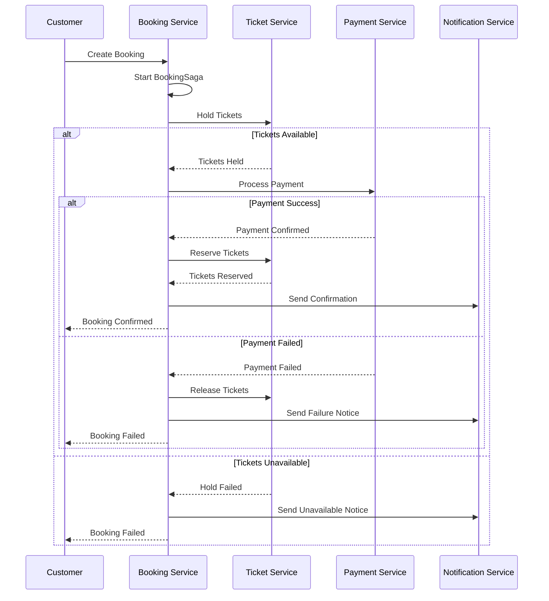
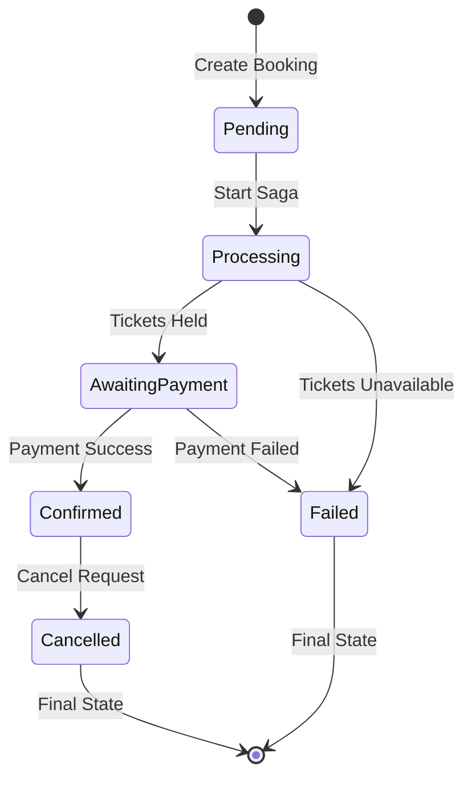

# Booking Service

The Booking Service is a .NET-based microservice responsible for managing the complete booking lifecycle within the Ticketer application, implementing the Saga pattern for distributed transactions.

## Overview

This service handles booking creation, status management, and orchestrates the complex booking flow involving ticket reservations, payments, and notifications. It implements the Saga pattern using MassTransit to ensure data consistency across distributed services.

## Features

- **Booking Creation**: Create new bookings with event and customer information
- **Saga Pattern**: Distributed transaction management using MassTransit
- **Status Management**: Track booking states throughout the lifecycle  
- **Ticket Reservation**: Integration with Ticket Service for seat reservations
- **Payment Integration**: Coordinate with Payment Service for transaction processing
- **Messaging**: RabbitMQ integration for event-driven communication
- **Dual Database**: PostgreSQL for saga state + MongoDB for booking data
- **Monitoring**: OpenTelemetry integration with Jaeger tracing
- **API Documentation**: Comprehensive Swagger/OpenAPI documentation

## Technology Stack

- **Framework**: .NET 9.0
- **Language**: C#
- **Databases**: PostgreSQL (Saga state), MongoDB (Booking data)
- **Messaging**: RabbitMQ via MassTransit 8.5.2
- **ORM**: Entity Framework Core 9.0.8
- **ODM**: MongoDB.Driver 2.22.0
- **Observability**: OpenTelemetry, Jaeger, Prometheus
- **Documentation**: Swashbuckle.AspNetCore
- **Mapping**: AutoMapper

## API Endpoints

### Booking Management (`/api/Booking`)

| Method | Endpoint | Description | Request Body | Response |
|--------|----------|-------------|--------------|----------|
| `POST` | `/` | Create new booking (Saga) | `CreateBookingDto` | `Guid` (Booking ID) |

### CRUD Operations (`/api/BookingCrud`)

| Method | Endpoint | Description | Request Body | Response |
|--------|----------|-------------|--------------|----------|
| `POST` | `/` | Create booking (Direct) | `CreateBookingDto` | `BookingDto` |
| `GET` | `/{bookingId}` | Get booking by ID | - | `BookingDto` |
| `GET` | `/` | Get all bookings | - | `IEnumerable<BookingDto>` |
| `PUT` | `/{bookingId}/status` | Update booking status | `string` | `204 No Content` |
| `GET` | `/{bookingId}/status` | Get booking status | - | `string` |
| `POST` | `/{bookingId}/cancel` | Cancel booking | - | `204 No Content` |
| `POST` | `/{bookingId}/success` | Mark as successful | - | `204 No Content` |
| `DELETE` | `/{bookingId}` | Delete booking | - | `204 No Content` |

## Data Models

### Request Models

**CreateBookingDto**
```json
{
  "customerId": "3fa85f64-5717-4562-b3fc-2c963f66afa6",
  "eventId": 1,
  "numberOfTickets": 2
}
```

**PaymentSuccessRequest**
```json
{
  "customerId": "3fa85f64-5717-4562-b3fc-2c963f66afa6",
  "amount": 199.98,
  "currency": "USD",
  "paymentIntentId": "pi_1234567890"
}
```

### Response Models

**BookingDto**
```json
{
  "bookingId": "3fa85f64-5717-4562-b3fc-2c963f66afa6",
  "customerId": "3fa85f64-5717-4562-b3fc-2c963f66afa6",
  "eventId": 1,
  "numberOfTickets": 2,
  "status": "Confirmed",
  "createdAt": "2024-01-01T00:00:00Z",
  "updatedAt": "2024-01-01T00:00:00Z"
}
```

## Booking Saga Flow

The service implements a sophisticated saga pattern for booking management:



## Booking States



## Configuration

### Environment Variables

| Variable | Description | Default |
|----------|-------------|---------|
| `ASPNETCORE_ENVIRONMENT` | ASP.NET Core environment | `Production` |
| `ASPNETCORE_URLS` | HTTP binding URLs | `http://+:80` |
| `ConnectionStrings__PostgresSQL` | PostgreSQL connection for saga state | Required |
| `MongoDb__ConnectionString` | MongoDB connection for booking data | Required |
| `MongoDb__DatabaseName` | MongoDB database name | `BookingServiceDb` |
| `MongoDb__BookingsCollectionName` | Bookings collection name | `Bookings` |
| `RabbitMq__Host` | RabbitMQ hostname | `localhost` |
| `RabbitMq__Username` | RabbitMQ username | `guest` |
| `RabbitMq__Password` | RabbitMQ password | `guest` |
| `RabbitMq__VirtualHost` | RabbitMQ virtual host | `/` |
| `OpenTelemetry__ServiceName` | Service name for tracing | `BookingService` |
| `OpenTelemetry__Jaeger__AgentHost` | Jaeger agent hostname | `localhost` |

### Application Ports

- **HTTP Port**: 80 (internal), 5200 (external)
- **PostgreSQL Port**: 5432 (external: 5436)
- **MongoDB Port**: 27017 (if used separately)

## Getting Started

### Prerequisites

- .NET 9.0 SDK
- PostgreSQL 15+
- MongoDB 6.0+ (optional, for separate deployment)
- RabbitMQ 3.x
- Docker (optional)

### Local Development

1. **Clone the repository**
```bash
git clone <repository-url>
cd services/BookingService
```

2. **Start Dependencies**
```bash
# PostgreSQL for saga state
docker run --name booking-db \
  -e POSTGRES_DB=BookingServiceDb \
  -e POSTGRES_USER=postgres \
  -e POSTGRES_PASSWORD=postgres \
  -p 5436:5432 \
  -d postgres:15

# RabbitMQ
docker run --name rabbitmq \
  -e RABBITMQ_DEFAULT_USER=guest \
  -e RABBITMQ_DEFAULT_PASS=guest \
  -p 5672:5672 \
  -p 15672:15672 \
  -d rabbitmq:3-management

# Jaeger (optional, for tracing)
docker run --name jaeger \
  -p 16686:16686 \
  -p 14268:14268 \
  -d jaegertracing/all-in-one:latest
```

3. **Configure application**
```json
// appsettings.Development.json
{
  "ConnectionStrings": {
    "PostgresSQL": "Host=localhost;Port=5436;Database=BookingServiceDb;Username=postgres;Password=postgres;"
  },
  "MongoDb": {
    "ConnectionString": "mongodb://localhost:27017",
    "DatabaseName": "BookingServiceDb",
    "BookingsCollectionName": "Bookings"
  },
  "RabbitMq": {
    "Host": "localhost",
    "Username": "guest",
    "Password": "guest",
    "VirtualHost": "/"
  }
}
```

4. **Run the application**
```bash
# Using .NET CLI
dotnet run

# Or build and run
dotnet build
dotnet bin/Debug/net9.0/BookingService.dll
```

5. **Access the API**
- **API Base URL**: http://localhost:5000
- **Swagger UI**: http://localhost:5000/swagger
- **Health Check**: http://localhost:5000/health
- **Metrics**: http://localhost:5000/metrics

### Docker Deployment

1. **Build Docker image**
```bash
docker build -t ticketer/booking-service -f Dockerfile ../..
```

2. **Run with Docker Compose**
```bash
# From root directory
docker compose up bookingservice
```

## Database Schema

### PostgreSQL (Saga State)
- **SagaState**: Stores MassTransit saga instances and state
- **OutboxMessage**: Outbox pattern for reliable messaging
- **InboxMessage**: Inbox pattern for idempotent message processing

### MongoDB (Booking Data)
```json
// Bookings Collection
{
  "_id": "ObjectId",
  "bookingId": "UUID",
  "customerId": "UUID", 
  "eventId": "Long",
  "numberOfTickets": "Int32",
  "status": "String",
  "createdAt": "DateTime",
  "updatedAt": "DateTime"
}
```

## Messaging Integration

### Published Events

| Event | Purpose | Payload |
|-------|---------|---------|
| `BookingCreatedEvent` | Initiate booking saga | BookingCreatedEvent |
| `TicketHoldRequestedEvent` | Request ticket hold | HoldTicketsRequest |
| `PaymentRequestedEvent` | Initiate payment | PaymentRequest |
| `BookingConfirmedEvent` | Booking successful | BookingConfirmedEvent |
| `BookingFailedEvent` | Booking failed | BookingFailedEvent |

### Consumed Events

| Event | Source | Handler |
|-------|--------|---------|
| `TicketHeldEvent` | Ticket Service | BookingSaga |
| `TicketHoldFailedEvent` | Ticket Service | BookingSaga |
| `PaymentSuccessEvent` | Payment Service | BookingSaga |
| `PaymentFailedEvent` | Payment Service | BookingSaga |
| `TicketReservedEvent` | Ticket Service | BookingSaga |

## Saga Pattern Implementation

The BookingSaga orchestrates the distributed transaction:

### Saga State
```csharp
public class BookingSagaState : SagaStateMachineInstance
{
    public Guid CorrelationId { get; set; }
    public string CurrentState { get; set; }
    public Guid BookingId { get; set; }
    public Guid CustomerId { get; set; }
    public long EventId { get; set; }
    public int NumberOfTickets { get; set; }
    public List<Guid> TicketIds { get; set; }
    public decimal PaymentAmount { get; set; }
}
```

### Saga Events
- **BookingCreated**: Start saga
- **TicketHeld**: Proceed to payment
- **TicketHoldFailed**: Cancel booking
- **PaymentSucceeded**: Confirm booking
- **PaymentFailed**: Release tickets and cancel

## Monitoring and Observability

### Distributed Tracing
- **OpenTelemetry**: Automatic instrumentation
- **Jaeger**: Distributed trace visualization
- **MassTransit**: Message tracing

### Metrics
- **Prometheus**: Application metrics
- **Custom Metrics**: Booking success rates, saga completion times
- **Health Checks**: Database, RabbitMQ, dependent services

### Logging
- **Structured Logging**: JSON format with correlation IDs
- **Log Correlation**: Trace booking flow across services
- **Error Tracking**: Comprehensive exception logging

## API Examples

### Create booking (Saga pattern)
```bash
curl -X POST http://localhost:5200/api/booking \
  -H "Content-Type: application/json" \
  -d '{
    "customerId": "3fa85f64-5717-4562-b3fc-2c963f66afa6",
    "eventId": 1,
    "numberOfTickets": 2
  }'
```

### Get booking details
```bash
curl -X GET http://localhost:5200/api/bookingcrud/3fa85f64-5717-4562-b3fc-2c963f66afa6
```

### Cancel booking
```bash
curl -X POST http://localhost:5200/api/bookingcrud/3fa85f64-5717-4562-b3fc-2c963f66afa6/cancel
```

## Integration with Other Services

### Service Dependencies
- **Ticket Service**: Ticket holding and reservation
- **Payment Service**: Payment processing
- **Notification Service**: Customer communications
- **Events Service**: Event validation

### Messaging Contracts
All messaging contracts are defined in the SharedLibrary project for consistency across services.

## Testing

```bash
# Run unit tests
dotnet test

# Run integration tests
dotnet test --filter Category=Integration

# Run with coverage
dotnet test --collect:"XPlat Code Coverage"
```

## Performance Considerations

- **Database Connection Pooling**: Optimized for high throughput
- **Message Batching**: Efficient RabbitMQ message processing
- **Async/Await**: Non-blocking I/O operations
- **Saga Cleanup**: Automatic cleanup of completed sagas
- **MongoDB Indexing**: Optimized queries on booking data

## Security

- **Input Validation**: Data annotations and model validation
- **SQL Injection Protection**: Entity Framework parameterized queries
- **Message Security**: RabbitMQ connection encryption
- **CORS**: Configurable cross-origin policies

## Contributing

1. Follow .NET coding standards and async/await patterns
2. Add unit tests for new functionality
3. Update Swagger documentation
4. Test saga flows thoroughly
5. Ensure proper error handling and compensation
6. Monitor distributed transaction performance

## Support

For issues and support:
- Check application logs: `docker logs bookingservice`
- Monitor saga state in PostgreSQL: `SELECT * FROM SagaState`
- Review RabbitMQ queues: http://localhost:15672
- Check Jaeger traces: http://localhost:16686
- Monitor health endpoint: `/health`