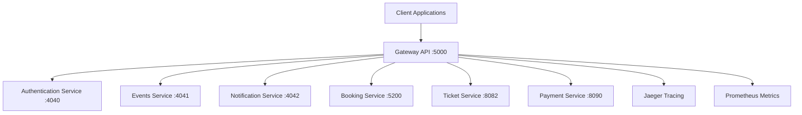

# Gateway API

The Gateway API is a .NET-based API Gateway service that provides unified access to all Ticketer microservices, implementing routing, service discovery, load balancing, and centralized API documentation.

## Overview

This service acts as the single entry point for all client requests to the Ticketer ecosystem. Built on YARP (Yet Another Reverse Proxy), it provides intelligent routing, health checks, observability, and unified API documentation across all microservices.

## Features

- **Reverse Proxy**: YARP-based intelligent request routing
- **Service Discovery**: Dynamic service routing and health monitoring
- **Unified API Documentation**: Centralized Swagger UI for all services
- **Load Balancing**: Automatic load distribution across service instances
- **Health Checks**: Proactive monitoring of downstream services
- **CORS Support**: Configurable cross-origin resource sharing
- **Observability**: OpenTelemetry integration with distributed tracing
- **Circuit Breaker**: Failure resilience and fault tolerance
- **Rate Limiting**: Request throttling and abuse prevention
- **Metrics Collection**: Prometheus metrics endpoint

## Technology Stack

- **Framework**: .NET 9.0
- **Language**: C#
- **Reverse Proxy**: YARP (Yet Another Reverse Proxy) 2.1.0
- **Observability**: OpenTelemetry, Jaeger, Prometheus
- **Documentation**: Swashbuckle.AspNetCore
- **Health Checks**: Microsoft.Extensions.Diagnostics.HealthChecks

## Service Architecture



## API Routes

### Service Routing

| Route Pattern | Target Service | Internal Address |
|---------------|----------------|------------------|
| `/api/auth/**` | Authentication Service | `http://auth-service:4040` |
| `/api/events/**` | Events Service | `http://events-service:4041` |
| `/api/notifications/**` | Notification Service | `http://notification-service:4042` |
| `/api/booking/**` | Booking Service | `http://bookingservice:80` |
| `/api/tickets/**` | Ticket Service | `http://ticketservice:8080` |
| `/api/payments/**` | Payment Service | `http://paymentservice:8090` |

### Gateway Endpoints

| Method | Endpoint | Description | Response |
|--------|----------|-------------|----------|
| `GET` | `/` | Gateway status | `{ "status": "ok", "service": "Gateway.Api" }` |
| `GET` | `/health` | Comprehensive health check | Health status with service details |
| `GET` | `/health/live` | Liveness probe | Simple alive status |
| `GET` | `/metrics` | Prometheus metrics | Metrics in Prometheus format |
| `GET` | `/swagger` | Unified API documentation | Swagger UI with all services |

## Configuration

### Environment Variables

| Variable | Description | Default |
|----------|-------------|---------|
| `ASPNETCORE_ENVIRONMENT` | ASP.NET Core environment | `Production` |
| `ASPNETCORE_URLS` | HTTP binding URLs | `http://+:80` |
| `Cors__AllowedOrigins__*` | Allowed CORS origins | See appsettings.json |
| `OpenTelemetry__Jaeger__Endpoint` | Jaeger tracing endpoint | `jaeger:6831` |
| `OpenTelemetry__Otlp__Endpoint` | OTEL collector endpoint | `http://otel-collector:4317` |

### Application Ports

- **HTTP Port**: 80 (internal), 5000 (external)
- **Health Check**: Same as HTTP port
- **Metrics**: `/metrics` endpoint on HTTP port

## Service Discovery and Health Checks

### Health Check Configuration
```json
{
  "HealthCheck": {
    "Active": {
      "Enabled": true,
      "Interval": "00:00:30",
      "Timeout": "00:00:10", 
      "Path": "/health"
    }
  }
}
```

### Health Check Strategy
- **Interval**: Check every 30 seconds
- **Timeout**: 10-second response timeout
- **Endpoint**: Each service's `/health` endpoint
- **Failure Handling**: Circuit breaker pattern for failed services

## Getting Started

### Prerequisites

- .NET 9.0 SDK
- Docker (for containerized deployment)
- Running microservices (or Docker Compose)

### Local Development

1. **Clone the repository**
```bash
git clone <repository-url>
cd services/Gateway.Api
```

2. **Configure services endpoints**
```json
// appsettings.Development.json
{
  "ReverseProxy": {
    "Clusters": {
      "booking-cluster": {
        "Destinations": {
          "booking": {
            "Address": "http://localhost:5200/"
          }
        }
      },
      "ticket-cluster": {
        "Destinations": {
          "ticket": {
            "Address": "http://localhost:8082/"
          }
        }
      }
    }
  }
}
```

3. **Run the application**
```bash
# Using .NET CLI
dotnet run

# Or build and run
dotnet build
dotnet bin/Debug/net9.0/Gateway.Api.dll
```

4. **Access the API**
- **Gateway Base URL**: http://localhost:5000
- **Unified Swagger UI**: http://localhost:5000/swagger
- **Health Check**: http://localhost:5000/health
- **Metrics**: http://localhost:5000/metrics

### Docker Deployment

1. **Build Docker image**
```bash
docker build -t ticketer/gateway-api -f Dockerfile ../..
```

2. **Run with Docker Compose**
```bash
# From root directory
docker compose up apigateway
```

## Unified API Documentation

The Gateway provides a centralized Swagger UI that aggregates all microservice APIs:

### Service Documentation
- **Gateway API**: Native gateway endpoints
- **Authentication Service**: User authentication and JWT management
- **Events Service**: Event management and lifecycle
- **Booking Service**: Booking creation and management
- **Ticket Service**: Ticket operations and reservations
- **Payment Service**: Payment processing
- **Notification Service**: Notification delivery

### Accessing Documentation
```bash
# Open unified Swagger UI
http://localhost:5000/swagger

# Individual service documentation
http://localhost:5000/api/booking/swagger/v1/swagger.json
http://localhost:5000/api/tickets/swagger/v1/swagger.json
http://localhost:5000/api/payments/swagger/v1/swagger.json
```

## Load Balancing and Failover

### Load Balancing Strategies
```json
{
  "LoadBalancingPolicy": "RoundRobin",
  "Destinations": {
    "service-1": { "Address": "http://service:80/" },
    "service-2": { "Address": "http://service-2:80/" }
  }
}
```

### Supported Policies
- **RoundRobin**: Distribute requests evenly
- **LeastRequests**: Route to least busy instance
- **Random**: Random distribution
- **PowerOfTwoChoices**: Optimized random selection

## Circuit Breaker and Resilience

### Failure Handling
```csharp
public class CircuitBreakerTransform : IProxyRequestTransform
{
    public ValueTask TransformRequestAsync(RequestTransformContext context)
    {
        // Implement circuit breaker logic
        if (IsServiceHealthy(context.DestinationPrefix))
        {
            return default;
        }
        
        context.HttpContext.Response.StatusCode = 503;
        return default;
    }
}
```

### Resilience Features
- **Circuit Breaker**: Fail fast for unhealthy services
- **Retry Logic**: Automatic retry for transient failures
- **Timeout Handling**: Request timeout management
- **Fallback Responses**: Graceful degradation

## Observability and Monitoring

### Distributed Tracing
```csharp
// OpenTelemetry Configuration
.WithTracing(tracing => tracing
    .AddAspNetCoreInstrumentation()
    .AddHttpClientInstrumentation()
    .AddJaegerExporter()
    .AddOtlpExporter())
```

### Metrics Collection
- **Request Rate**: Requests per second
- **Response Time**: Latency percentiles
- **Error Rate**: Error percentage by service
- **Service Health**: Health check results

### Health Check Response
```json
{
  "status": "Healthy",
  "checks": [
    {
      "name": "booking-cluster",
      "status": "Healthy",
      "description": "Health check for booking service",
      "duration": "00:00:00.0234567"
    }
  ]
}
```

## CORS Configuration

### CORS Policy
```json
{
  "Cors": {
    "AllowedOrigins": [
      "http://localhost",
      "https://localhost", 
      "http://localhost:3000",
      "http://localhost:5173"
    ]
  }
}
```

### CORS Features
- **Configurable Origins**: Environment-specific origins
- **Credential Support**: Allow credentials in requests
- **Header Control**: Custom header allowances
- **Method Control**: HTTP method restrictions

## Request/Response Transformation

### Path Transformations
```json
{
  "Routes": {
    "booking-route": {
      "Match": { "Path": "/api/booking/{**catch-all}" },
      "Transforms": [
        { "PathRemovePrefix": "/api/booking" },
        { "RequestHeader": "X-Gateway-Version" }
      ]
    }
  }
}
```

### Available Transforms
- **Path Manipulation**: Prefix/suffix addition/removal
- **Header Injection**: Add gateway metadata
- **Query Parameters**: Modify request parameters
- **Request/Response Body**: Content transformation

## Security Features

### Security Headers
```csharp
app.Use(async (context, next) =>
{
    context.Response.Headers.Add("X-Gateway-Version", "1.0");
    context.Response.Headers.Add("X-Content-Type-Options", "nosniff");
    context.Response.Headers.Add("X-Frame-Options", "DENY");
    await next();
});
```

### Security Policies
- **HTTPS Enforcement**: Redirect HTTP to HTTPS
- **Security Headers**: Standard security headers
- **IP Filtering**: Allow/deny specific IPs
- **Rate Limiting**: Request throttling

## API Examples

### Health Check
```bash
curl http://localhost:5000/health
```

### Service Routing Examples
```bash
# Authentication
curl http://localhost:5000/api/auth/login \
  -H "Content-Type: application/json" \
  -d '{"email": "user@example.com", "password": "password"}'

# Events
curl http://localhost:5000/api/events

# Bookings
curl http://localhost:5000/api/booking \
  -H "Content-Type: application/json" \
  -d '{"customerId": "...", "eventId": 1, "numberOfTickets": 2}'

# Tickets
curl http://localhost:5000/api/tickets/event/1

# Payments
curl http://localhost:5000/api/payments \
  -H "Content-Type: application/json" \
  -d '{"bookingId": "...", "amount": 199.99}'
```

## Integration with Microservices

### Service Integration
- **Authentication Service**: JWT token validation
- **Events Service**: Event data retrieval
- **Booking Service**: Booking orchestration
- **Ticket Service**: Ticket management
- **Payment Service**: Payment processing
- **Notification Service**: Notification delivery

### Request Flow
1. **Client Request**: Client sends request to gateway
2. **Route Matching**: Gateway matches request to service route
3. **Health Check**: Verify target service health
4. **Load Balancing**: Select healthy service instance
5. **Request Forwarding**: Forward request to service
6. **Response Handling**: Process and return response
7. **Observability**: Log metrics and traces

## Monitoring and Alerting

### Key Metrics
- **Gateway Availability**: Uptime percentage
- **Service Health**: Individual service status
- **Request Throughput**: Requests per second
- **Error Rates**: 4xx/5xx error percentages
- **Response Times**: Latency distributions

### Prometheus Metrics
```bash
# Gateway metrics endpoint
curl http://localhost:5000/metrics

# Key metrics
- http_requests_total
- http_request_duration_seconds
- yarp_proxy_requests_total
- dotnet_gc_collections_total
```

## Troubleshooting

### Common Issues

1. **Service Unavailable (503)**
   - Check service health: `curl http://localhost:5000/health`
   - Verify service endpoints in configuration
   - Check Docker container status

2. **CORS Errors**
   - Verify allowed origins in configuration
   - Check request headers and methods
   - Ensure credentials policy matches client

3. **Route Not Found (404)**
   - Verify route configuration in appsettings.json
   - Check path patterns and transforms
   - Validate service cluster destinations

### Debugging Commands
```bash
# Check gateway health
curl http://localhost:5000/health

# View metrics
curl http://localhost:5000/metrics

# Check Docker logs
docker logs apigateway

# Check service connectivity
docker exec apigateway curl http://bookingservice/health
```

## Testing

### Integration Testing
```bash
# Health checks
dotnet test --filter Category=HealthCheck

# Route testing
dotnet test --filter Category=Routing

# Load testing
dotnet test --filter Category=Load
```

### Load Testing
```bash
# Use artillery or similar tools
npm install -g artillery
artillery quick --count 100 --num 10 http://localhost:5000/api/events
```

## Performance Optimization

### Caching Strategies
- **Response Caching**: Cache static responses
- **Health Check Caching**: Cache health check results
- **Configuration Caching**: Cache route configurations

### Connection Pooling
```json
{
  "HttpClientConfig": {
    "MaxConnectionsPerServer": 100,
    "ConnectTimeout": "00:00:30",
    "ExpectContinueTimeout": "00:00:01"
  }
}
```

## Contributing

1. Follow .NET coding standards and async/await patterns
2. Add comprehensive tests for new routes and transforms
3. Update API documentation and route configurations
4. Test integration with all microservices
5. Monitor performance impact of changes
6. Ensure proper error handling and logging

## Support

For issues and support:
- Check application logs: `docker logs apigateway`
- Monitor health endpoint: `/health`
- Review metrics: `/metrics`
- Check unified Swagger documentation: `/swagger`
- Monitor Jaeger traces for request flows
- Verify service connectivity and health status