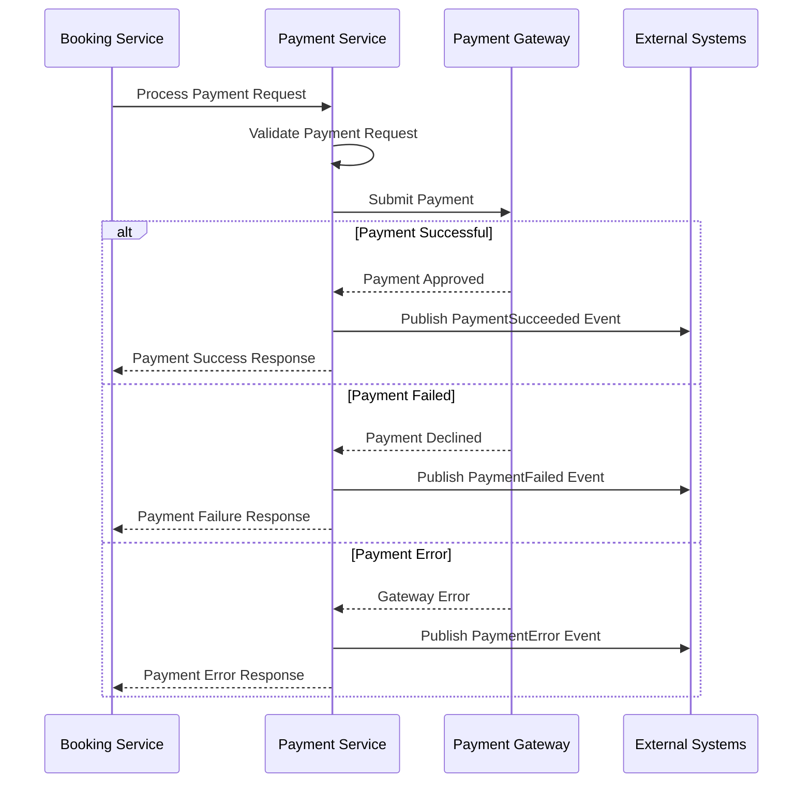

# Payment Service

The Payment Service is a .NET-based microservice responsible for processing payments, handling payment-related operations, and integrating with the booking saga within the Ticketer application.

## Overview

This service provides a secure and scalable payment processing solution, handling payment transactions, validation, and integration with the booking workflow. It's designed as a stateless service that focuses on payment orchestration and external payment gateway integration.

## Features

- **Payment Processing**: Secure payment transaction handling
- **Multiple Payment Methods**: Support for various payment methods
- **Saga Integration**: Participates in the booking saga pattern
- **Event-Driven**: Publishes payment events for downstream services
- **Monitoring**: OpenTelemetry integration with comprehensive observability
- **Health Checks**: Built-in health monitoring endpoints
- **API Documentation**: Comprehensive Swagger/OpenAPI documentation
- **Stateless Design**: No persistent storage, focuses on processing

## Technology Stack

- **Framework**: .NET 9.0
- **Language**: C#
- **Messaging**: RabbitMQ via MassTransit 8.5.2
- **Observability**: OpenTelemetry, Jaeger, Prometheus
- **Documentation**: Swashbuckle.AspNetCore
- **Health Checks**: Microsoft.Extensions.Diagnostics.HealthChecks

## API Endpoints

### Payment Processing (`/api/Payment`)

| Method | Endpoint | Description | Request Body | Response |
|--------|----------|-------------|--------------|----------|
| `POST` | `/` | Process payment | `ProcessPaymentDto` | `PaymentResultDto` |

## Data Models

### Request Models

**ProcessPaymentDto**
```json
{
  "bookingId": "3fa85f64-5717-4562-b3fc-2c963f66afa6",
  "customerId": "customer123",
  "amount": 199.99,
  "paymentMethod": "credit_card"
}
```

### Response Models

**PaymentResultDto**
```json
{
  "paymentIntentId": "pi_1234567890",
  "bookingId": "3fa85f64-5717-4562-b3fc-2c963f66afa6",
  "isSuccess": true,
  "errorMessage": null,
  "paymentMethod": "credit_card",
  "status": "succeeded",
  "amount": 199.99,
  "payedAt": "2024-01-01T00:00:00Z",
  "customerId": "customer123"
}
```

## Payment Flow



## Configuration

### Environment Variables

| Variable | Description | Default |
|----------|-------------|---------|
| `ASPNETCORE_ENVIRONMENT` | ASP.NET Core environment | `Production` |
| `ASPNETCORE_URLS` | HTTP binding URLs | `http://+:8090` |
| `RabbitMq__Host` | RabbitMQ hostname | `localhost` |
| `RabbitMq__Username` | RabbitMQ username | `guest` |
| `RabbitMq__Password` | RabbitMQ password | `guest` |
| `RabbitMq__VirtualHost` | RabbitMQ virtual host | `/` |
| `PaymentGateway__ApiKey` | Payment gateway API key | Required |
| `PaymentGateway__SecretKey` | Payment gateway secret key | Required |
| `PaymentGateway__WebhookSecret` | Webhook signature secret | Required |

### Application Ports

- **HTTP Port**: 8090 (both internal and external)

## Getting Started

### Prerequisites

- .NET 9.0 SDK
- RabbitMQ 3.x
- Docker (optional)
- Payment Gateway Account (Stripe, PayPal, etc.)

### Local Development

1. **Clone the repository**
```bash
git clone <repository-url>
cd services/PaymentService
```

2. **Start Dependencies**
```bash
# RabbitMQ
docker run --name rabbitmq \
  -e RABBITMQ_DEFAULT_USER=guest \
  -e RABBITMQ_DEFAULT_PASS=guest \
  -p 5672:5672 \
  -p 15672:15672 \
  -d rabbitmq:3-management

# Jaeger (optional, for tracing)
docker run --name jaeger \
  -p 16686:16686 \
  -p 14268:14268 \
  -d jaegertracing/all-in-one:latest
```

3. **Configure application**
```json
// appsettings.Development.json
{
  "RabbitMq": {
    "Host": "localhost",
    "Username": "guest",
    "Password": "guest",
    "VirtualHost": "/"
  },
  "PaymentGateway": {
    "ApiKey": "your-test-api-key",
    "SecretKey": "your-test-secret-key",
    "WebhookSecret": "your-webhook-secret"
  }
}
```

4. **Run the application**
```bash
# Using .NET CLI
dotnet run

# Or build and run
dotnet build
dotnet bin/Debug/net9.0/PaymentService.dll
```

5. **Access the API**
- **API Base URL**: http://localhost:8090
- **Swagger UI**: http://localhost:8090/swagger
- **Health Check**: http://localhost:8090/health
- **Metrics**: http://localhost:8090/metrics

### Docker Deployment

1. **Build Docker image**
```bash
docker build -t ticketer/payment-service -f Dockerfile ../..
```

2. **Run with Docker Compose**
```bash
# From root directory
docker compose up paymentservice
```

## Messaging Integration

### Consumed Events

| Event | Source | Handler | Purpose |
|-------|--------|---------|---------|
| `PaymentRequested` | Booking Service | PaymentRequestedConsumer | Process payment request |

### Published Events

| Event | Target | Purpose |
|-------|--------|---------|
| `PaymentSucceeded` | Booking Service | Notify successful payment |
| `PaymentFailed` | Booking Service | Notify failed payment |
| `PaymentError` | Booking Service | Notify payment processing error |

### Message Contracts

**PaymentRequested**
```json
{
  "bookingId": "3fa85f64-5717-4562-b3fc-2c963f66afa6",
  "customerId": "customer123",
  "amount": 199.99,
  "currency": "USD",
  "paymentMethod": "credit_card"
}
```

**PaymentSucceeded**
```json
{
  "paymentId": "pi_1234567890",
  "bookingId": "3fa85f64-5717-4562-b3fc-2c963f66afa6",
  "amount": 199.99,
  "currency": "USD",
  "paidAt": "2024-01-01T00:00:00Z"
}
```

**PaymentFailed**
```json
{
  "bookingId": "3fa85f64-5717-4562-b3fc-2c963f66afa6",
  "errorCode": "card_declined",
  "errorMessage": "Your card was declined.",
  "failedAt": "2024-01-01T00:00:00Z"
}
```

## Payment Gateway Integration

The service is designed to integrate with multiple payment gateways:

### Supported Payment Methods
- Credit/Debit Cards
- Digital Wallets (Apple Pay, Google Pay)
- Bank Transfers
- Alternative Payment Methods

### Security Features
- **PCI DSS Compliance**: Secure card data handling
- **Tokenization**: Card data tokenization
- **Encryption**: End-to-end encryption
- **Webhook Validation**: Secure webhook processing
- **Fraud Detection**: Integration with gateway fraud tools

## Business Logic

### Payment Processing Flow
1. **Validation**: Validate payment request data
2. **Gateway Integration**: Submit to payment gateway
3. **Result Processing**: Handle gateway response
4. **Event Publishing**: Notify other services
5. **Error Handling**: Manage failures gracefully

### Payment States
- **Pending**: Payment initiated
- **Processing**: Payment being processed
- **Succeeded**: Payment completed successfully
- **Failed**: Payment failed
- **Cancelled**: Payment cancelled
- **Refunded**: Payment refunded

## Error Handling

### Payment Errors
```json
{
  "errorCode": "insufficient_funds",
  "errorMessage": "Your card has insufficient funds.",
  "bookingId": "3fa85f64-5717-4562-b3fc-2c963f66afa6",
  "retryable": false
}
```

### Common Error Codes
- `card_declined`: Card was declined
- `insufficient_funds`: Insufficient balance
- `expired_card`: Card has expired
- `invalid_card`: Invalid card details
- `processing_error`: Gateway processing error
- `fraud_detected`: Potential fraud detected

## Monitoring and Observability

### Health Checks
- **RabbitMQ**: Message broker connectivity
- **Payment Gateway**: External service availability
- **Application**: Service health status

### Metrics
- **Custom Metrics**:
  - Payment success rate
  - Payment processing time
  - Gateway response time
  - Error rates by type
- **Business Metrics**:
  - Transaction volume
  - Revenue processed
  - Failed payment reasons

### Logging
- **Structured Logging**: JSON format with correlation IDs
- **Security Logging**: PCI-compliant logging (no sensitive data)
- **Performance Logging**: Gateway response times
- **Business Logging**: Transaction audit trail

## API Examples

### Process payment
```bash
curl -X POST http://localhost:8090/api/payment \
  -H "Content-Type: application/json" \
  -d '{
    "bookingId": "3fa85f64-5717-4562-b3fc-2c963f66afa6",
    "customerId": "customer123",
    "amount": 199.99,
    "paymentMethod": "credit_card"
  }'
```

### Response example (Success)
```json
{
  "paymentIntentId": "pi_1234567890",
  "bookingId": "3fa85f64-5717-4562-b3fc-2c963f66afa6",
  "isSuccess": true,
  "errorMessage": null,
  "paymentMethod": "credit_card",
  "status": "succeeded",
  "amount": 199.99,
  "payedAt": "2024-01-01T12:00:00Z",
  "customerId": "customer123"
}
```

### Response example (Failure)
```json
{
  "paymentIntentId": null,
  "bookingId": "3fa85f64-5717-4562-b3fc-2c963f66afa6",
  "isSuccess": false,
  "errorMessage": "Your card was declined.",
  "paymentMethod": "credit_card",
  "status": "failed",
  "amount": 199.99,
  "payedAt": "2024-01-01T12:00:00Z",
  "customerId": "customer123"
}
```

## Integration with Other Services

### Service Dependencies
- **Booking Service**: Receives payment requests, sends results
- **RabbitMQ**: Event messaging
- **Payment Gateway**: External payment processing

### Saga Participation
The Payment Service participates in the booking saga:
1. Receives `PaymentRequested` event
2. Processes payment with gateway
3. Publishes success/failure events
4. Booking saga continues based on result

## Testing

### Unit Testing
```bash
# Run unit tests
dotnet test --filter Category=Unit

# Run with coverage
dotnet test --collect:"XPlat Code Coverage"
```

### Integration Testing
```bash
# Run integration tests (with test payment gateway)
dotnet test --filter Category=Integration
```

### Load Testing
```bash
# Run load tests
dotnet test --filter Category=Load
```

## Security Considerations

### PCI DSS Compliance
- **No Storage**: Service doesn't store sensitive payment data
- **Tokenization**: Use payment gateway tokens
- **Encryption**: All data in transit encrypted
- **Logging**: No sensitive data in logs
- **Access Control**: Restricted access to payment operations

### API Security
- **HTTPS Only**: All communications over HTTPS
- **Input Validation**: Comprehensive request validation
- **Rate Limiting**: Prevent abuse and brute force attacks
- **Webhook Security**: Validate webhook signatures

## Webhook Handling

### Payment Gateway Webhooks
```csharp
[HttpPost("webhook")]
public async Task<IActionResult> HandleWebhook([FromBody] WebhookPayload payload)
{
    // Validate webhook signature
    if (!ValidateWebhookSignature(payload))
        return Unauthorized();
    
    // Process webhook event
    await ProcessWebhookEvent(payload);
    
    return Ok();
}
```

### Webhook Events
- `payment.succeeded`: Payment completed
- `payment.failed`: Payment failed
- `payment.cancelled`: Payment cancelled
- `refund.created`: Refund processed

## Troubleshooting

### Common Issues
1. **Gateway Timeouts**: Implement retry logic with exponential backoff
2. **Webhook Validation**: Ensure correct signature validation
3. **Network Issues**: Handle connectivity problems gracefully
4. **Rate Limiting**: Respect gateway rate limits

### Debugging Commands
```bash
# Check application health
curl http://localhost:8090/health

# Monitor RabbitMQ queues
# Visit http://localhost:15672

# Check application logs
docker logs paymentservice
```

## Contributing

1. Follow .NET coding standards and async/await patterns
2. Maintain PCI DSS compliance in all changes
3. Add comprehensive tests for payment flows
4. Update API documentation
5. Test with sandbox payment gateways
6. Ensure proper error handling and logging

## Support

For issues and support:
- Check application logs: `docker logs paymentservice`
- Monitor health endpoint: `/health`
- Review payment gateway dashboard
- Check RabbitMQ management UI: http://localhost:15672
- Monitor Jaeger traces: http://localhost:16686
- Review payment gateway webhook logs