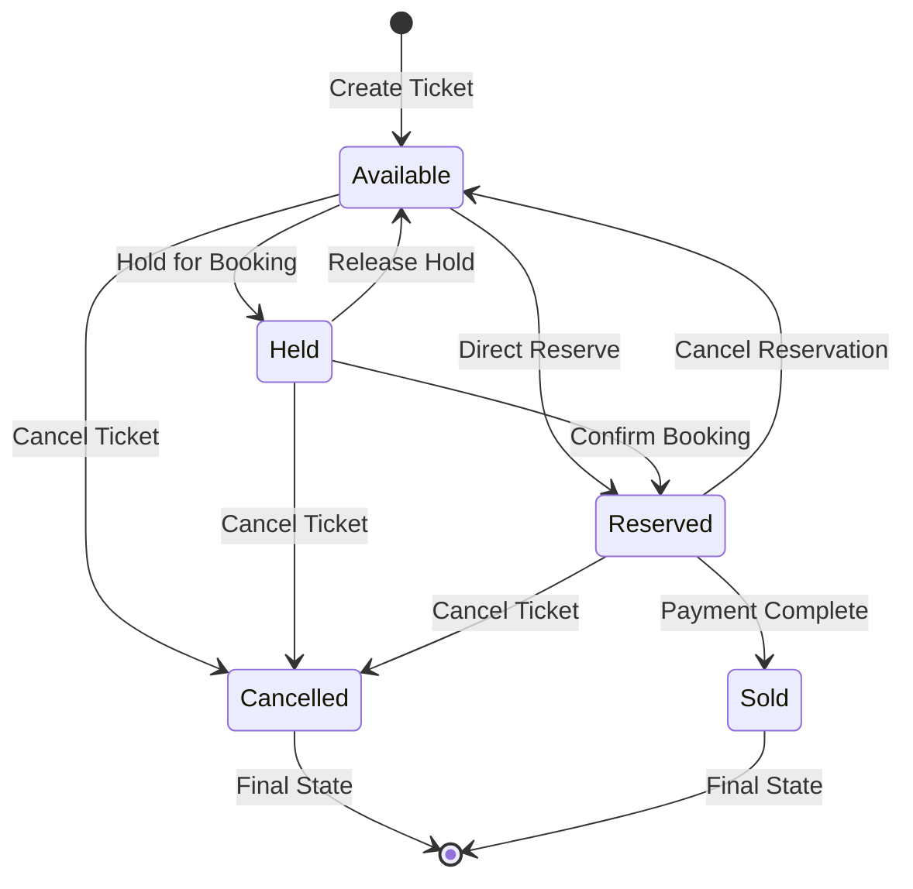

# Ticket Service

The Ticket Service is a .NET-based microservice responsible for comprehensive ticket management, including creation, reservation, status tracking, and distributed locking to handle high-concurrency ticket operations.

## Overview

This service manages the complete ticket lifecycle from creation to reservation, implementing sophisticated concurrency control mechanisms to handle high-demand events. It provides both individual and bulk ticket operations with Redis-based distributed locking for consistency.

## Features

- **Ticket Creation**: Create individual tickets or bulk ticket batches
- **Distributed Locking**: Redis-based distributed locking with RedLock.NET
- **Status Management**: Track ticket states (Available, Reserved, Sold, Held, Cancelled)
- **High Concurrency**: Optimized for handling simultaneous ticket operations
- **Bulk Operations**: Efficient bulk ticket creation and status updates
- **Event Integration**: Automatic ticket creation when events are published
- **Messaging**: RabbitMQ integration for event-driven operations
- **Caching**: Redis caching for improved performance
- **Monitoring**: OpenTelemetry integration with comprehensive observability
- **API Documentation**: Detailed Swagger/OpenAPI documentation

## Technology Stack

- **Framework**: .NET 9.0
- **Language**: C#
- **Database**: PostgreSQL with Entity Framework Core
- **Caching**: Redis with StackExchange.Redis
- **Distributed Locking**: RedLock.NET 2.3.2
- **Messaging**: RabbitMQ via MassTransit 8.5.2
- **Observability**: OpenTelemetry, Jaeger, Prometheus
- **Documentation**: Swashbuckle.AspNetCore
- **Mapping**: AutoMapper

## API Endpoints

### Ticket Management (`/api/Ticket`)

| Method | Endpoint | Description | Request Body | Response |
|--------|----------|-------------|--------------|----------|
| `GET` | `/` | Get all tickets | - | `IEnumerable<TicketResponse>` |
| `GET` | `/{id}` | Get ticket by ID | - | `TicketResponse` |
| `GET` | `/event/{eventId}` | Get tickets by event ID | - | `IEnumerable<TicketResponse>` |
| `POST` | `/` | Create ticket(s) | `CreateTicketRequest` | `TicketResponse` or `List<TicketResponse>` |
| `POST` | `/bulk` | Create bulk tickets | `CreateTicketRequest` | `BulkCreationResponse` |
| `PATCH` | `/{id}/status` | Update ticket status | `UpdateStatusRequest` | `TicketStatusResponse` |
| `DELETE` | `/{id}` | Delete ticket | - | `204 No Content` |

### Test Endpoints (Development)

| Method | Endpoint | Description | Request Body | Response |
|--------|----------|-------------|--------------|----------|
| `POST` | `/reserve` | Reserve tickets | `ReserveTicketsRequest` | `bool` |
| `POST` | `/release` | Release tickets | `ReleaseTicketsRequest` | `bool` |

## Data Models

### Request Models

**CreateTicketRequest**
```json
{
  "eventId": 1,
  "quantity": 100
}
```

**UpdateStatusRequest**
```json
{
  "status": "Reserved"
}
```

**ReserveTicketsRequest**
```json
{
  "eventId": 1,
  "ticketIds": [
    "3fa85f64-5717-4562-b3fc-2c963f66afa6",
    "3fa85f64-5717-4562-b3fc-2c963f66afa7"
  ]
}
```

### Response Models

**TicketResponse**
```json
{
  "ticketId": "3fa85f64-5717-4562-b3fc-2c963f66afa6",
  "eventId": 1,
  "status": "Available"
}
```

**BulkCreationResponse**
```json
{
  "eventId": 1,
  "ticketsCreated": 100,
  "message": "Successfully created 100 tickets for event 1"
}
```

**TicketStatusResponse**
```json
{
  "ticketId": "3fa85f64-5717-4562-b3fc-2c963f66afa6",
  "status": "Reserved",
  "previousStatus": "Available",
  "updatedAt": "2024-01-01T00:00:00Z"
}
```

## Ticket Status Lifecycle



### Status Descriptions
- **Available**: Ticket is available for purchase
- **Held**: Temporary hold during booking process (with timeout)
- **Reserved**: Ticket reserved for customer (awaiting payment)
- **Sold**: Ticket purchased and paid for
- **Cancelled**: Ticket cancelled and unavailable

## Configuration

### Environment Variables

| Variable | Description | Default |
|----------|-------------|---------|
| `ASPNETCORE_ENVIRONMENT` | ASP.NET Core environment | `Production` |
| `ASPNETCORE_URLS` | HTTP binding URLs | `http://+:80` |
| `ConnectionStrings__DefaultConnection` | PostgreSQL connection | Required |
| `ConnectionStrings__Redis` | Redis connection string | `localhost:6379` |
| `DatabaseProvider` | Database provider | `PostgreSQL` |
| `Redis__Endpoints__0` | Redis endpoint | `localhost:6379` |
| `RabbitMq__Host` | RabbitMQ hostname | `localhost` |
| `RabbitMq__Username` | RabbitMQ username | `guest` |
| `RabbitMq__Password` | RabbitMQ password | `guest` |
| `RabbitMq__VirtualHost` | RabbitMQ virtual host | `/` |

### Application Ports

- **HTTP Port**: 80 (internal), 8082 (external)
- **PostgreSQL Port**: 5432 (external: 5435)
- **Redis Port**: 6379

## Getting Started

### Prerequisites

- .NET 9.0 SDK
- PostgreSQL 15+
- Redis 7.0+
- RabbitMQ 3.x
- Docker (optional)

### Local Development

1. **Clone the repository**
```bash
git clone <repository-url>
cd services/TicketService
```

2. **Start Dependencies**
```bash
# PostgreSQL
docker run --name ticket-db \
  -e POSTGRES_DB=TicketServiceDb \
  -e POSTGRES_USER=postgres \
  -e POSTGRES_PASSWORD=postgres \
  -p 5435:5432 \
  -d postgres:15

# Redis
docker run --name redis \
  --command redis-server --appendonly yes \
  -p 6379:6379 \
  -d redis:7-alpine

# RabbitMQ
docker run --name rabbitmq \
  -e RABBITMQ_DEFAULT_USER=guest \
  -e RABBITMQ_DEFAULT_PASS=guest \
  -p 5672:5672 \
  -p 15672:15672 \
  -d rabbitmq:3-management
```

3. **Configure application**
```json
// appsettings.Development.json
{
  "ConnectionStrings": {
    "DefaultConnection": "Host=localhost;Port=5435;Database=TicketServiceDb;Username=postgres;Password=postgres;",
    "Redis": "localhost:6379"
  },
  "DatabaseProvider": "PostgreSQL",
  "RabbitMq": {
    "Host": "localhost",
    "Username": "guest",
    "Password": "guest",
    "VirtualHost": "/"
  }
}
```

4. **Run database migrations**
```bash
dotnet ef database update
```

5. **Run the application**
```bash
# Using .NET CLI
dotnet run

# Or build and run
dotnet build
dotnet bin/Debug/net9.0/TicketService.dll
```

6. **Access the API**
- **API Base URL**: http://localhost:8082
- **Swagger UI**: http://localhost:8082/swagger
- **Health Check**: http://localhost:8082/health
- **Metrics**: http://localhost:8082/metrics

### Docker Deployment

1. **Build Docker image**
```bash
docker build -t ticketer/ticket-service -f Dockerfile ../..
```

2. **Run with Docker Compose**
```bash
# From root directory
docker compose up ticketservice
```

## Database Schema

### Tickets Table
```sql
CREATE TABLE Tickets (
    TicketId UUID PRIMARY KEY DEFAULT gen_random_uuid(),
    EventId BIGINT NOT NULL,
    Status VARCHAR(20) NOT NULL DEFAULT 'Available',
    CreatedAt TIMESTAMP WITH TIME ZONE DEFAULT NOW(),
    UpdatedAt TIMESTAMP WITH TIME ZONE DEFAULT NOW(),
    Version INTEGER DEFAULT 0 -- For optimistic locking
);

-- Indexes for performance
CREATE INDEX IX_Tickets_EventId ON Tickets(EventId);
CREATE INDEX IX_Tickets_Status ON Tickets(Status);
CREATE INDEX IX_Tickets_EventId_Status ON Tickets(EventId, Status);
```

## Distributed Locking Strategy

The service implements sophisticated distributed locking to handle high-concurrency scenarios:

### RedLock Implementation
```csharp
public async Task<bool> ReserveTicketsAsync(List<Guid> ticketIds, long eventId)
{
    var lockKey = $"tickets:event:{eventId}";
    var expiry = TimeSpan.FromSeconds(30);
    
    using var redLock = await _redLockFactory.CreateLockAsync(
        lockKey, expiry, TimeSpan.FromSeconds(5), TimeSpan.FromMilliseconds(100));
    
    if (redLock.IsAcquired)
    {
        // Perform ticket reservation with database transaction
        return await ReserveTicketsWithTransaction(ticketIds, eventId);
    }
    
    return false; // Could not acquire lock
}
```

### Lock Strategies
- **Event-level locking**: `tickets:event:{eventId}` for bulk operations
- **Ticket-level locking**: `ticket:{ticketId}` for individual operations
- **Batch locking**: Multiple locks for batch operations

## Messaging Integration

### Consumed Events

| Event | Source | Handler | Purpose |
|-------|--------|---------|---------|
| `EventPublishedEvent` | Events Service | EventPublishedConsumer | Create tickets for new events |
| `HoldTicketsRequest` | Booking Service | HoldTicketsConsumer | Hold tickets for booking |
| `ReserveTicketsRequest` | Booking Service | ReserveTicketsConsumer | Reserve tickets after payment |
| `ReleaseTicketsRequest` | Booking Service | ReleaseTicketsConsumer | Release held/reserved tickets |

### Published Events

| Event | Purpose | Consumers |
|-------|---------|-----------|
| `TicketHeldEvent` | Tickets successfully held | Booking Service |
| `TicketHoldFailedEvent` | Ticket hold failed | Booking Service |
| `TicketReservedEvent` | Tickets successfully reserved | Booking Service |
| `TicketReservationFailedEvent` | Ticket reservation failed | Booking Service |

## Performance Optimizations

### Database Optimizations
- **Connection Pooling**: Optimized PostgreSQL connection pool
- **Bulk Operations**: Efficient batch inserts and updates
- **Optimistic Locking**: Version-based concurrency control
- **Query Optimization**: Strategic indexing for ticket lookups

### Caching Strategy
- **Redis Caching**: Frequently accessed ticket data
- **Cache-aside Pattern**: Cache miss handling
- **Cache Invalidation**: Event-driven cache updates
- **Distributed Cache**: Shared cache across instances

### Concurrency Handling
- **Row-level Locking**: PostgreSQL SELECT FOR UPDATE
- **Distributed Locking**: Redis-based locks for consistency
- **Optimistic Concurrency**: Version-based conflict resolution
- **Retry Mechanisms**: Exponential backoff for failed operations

## API Examples

### Create bulk tickets
```bash
curl -X POST http://localhost:8082/api/ticket/bulk \
  -H "Content-Type: application/json" \
  -d '{
    "eventId": 1,
    "quantity": 1000
  }'
```

### Get tickets for an event
```bash
curl -X GET "http://localhost:8082/api/ticket/event/1"
```

### Reserve specific tickets
```bash
curl -X POST http://localhost:8082/api/ticket/reserve \
  -H "Content-Type: application/json" \
  -d '{
    "eventId": 1,
    "ticketIds": [
      "3fa85f64-5717-4562-b3fc-2c963f66afa6",
      "3fa85f64-5717-4562-b3fc-2c963f66afa7"
    ]
  }'
```

### Update ticket status
```bash
curl -X PATCH http://localhost:8082/api/ticket/3fa85f64-5717-4562-b3fc-2c963f66afa6/status \
  -H "Content-Type: application/json" \
  -d '{
    "status": "Sold"
  }'
```

## Integration with Other Services

### Service Dependencies
- **Events Service**: Event validation and ticket creation triggers
- **Booking Service**: Ticket holding, reservation, and release operations
- **Redis**: Distributed locking and caching
- **PostgreSQL**: Persistent ticket storage

### Messaging Patterns
- **Event-driven**: Reactive to event publishing
- **Command-response**: Synchronous ticket operations
- **Saga participation**: Part of booking saga transactions

## Monitoring and Observability

### Health Checks
- **Database**: PostgreSQL connectivity and query performance
- **Redis**: Cache connectivity and operation latency
- **RabbitMQ**: Message broker connectivity

### Metrics
- **Custom Metrics**:
  - Ticket creation rate
  - Reservation success/failure rate
  - Lock acquisition time
  - Cache hit/miss ratio
- **System Metrics**: CPU, memory, database connections
- **OpenTelemetry**: Distributed tracing across operations

### Logging
- **Structured Logging**: JSON format with correlation IDs
- **Performance Logging**: Slow operation detection
- **Error Tracking**: Comprehensive exception logging
- **Business Metrics**: Ticket operation analytics

## Testing

### Unit Testing
```bash
# Run unit tests
dotnet test --filter Category=Unit

# Run with coverage
dotnet test --collect:"XPlat Code Coverage"
```

### Integration Testing
```bash
# Run integration tests (requires test containers)
dotnet test --filter Category=Integration

# Load testing
dotnet test --filter Category=Load
```

### Performance Testing
- **Concurrent Reservations**: Test high-concurrency scenarios
- **Bulk Operations**: Validate bulk creation performance
- **Lock Contention**: Test distributed locking under load
- **Database Performance**: Query optimization validation

## Security Considerations

- **Input Validation**: Comprehensive request validation
- **SQL Injection Protection**: Entity Framework parameterized queries
- **Redis Security**: Connection encryption and authentication
- **Rate Limiting**: Prevent abuse of bulk operations
- **Audit Logging**: Track all ticket status changes

## Troubleshooting

### Common Issues
1. **Lock Timeouts**: Increase Redis lock expiry or reduce operation time
2. **High Contention**: Implement back-pressure or queue-based processing
3. **Cache Misses**: Optimize cache warming strategies
4. **Database Deadlocks**: Review transaction scope and lock ordering

### Monitoring Commands
```bash
# Check Redis locks
redis-cli KEYS "tickets:*"

# Monitor PostgreSQL connections
SELECT * FROM pg_stat_activity WHERE application_name LIKE '%TicketService%';

# Check ticket distribution
SELECT status, COUNT(*) FROM tickets GROUP BY status;
```

## Contributing

1. Follow .NET coding standards and async/await patterns
2. Add comprehensive unit tests for new functionality
3. Test high-concurrency scenarios thoroughly
4. Update API documentation
5. Monitor performance impact of changes
6. Ensure proper error handling and logging

## Support

For issues and support:
- Check application logs: `docker logs ticketservice`
- Monitor Redis: `redis-cli monitor`
- Check PostgreSQL: Review slow query logs
- Monitor health endpoint: `/health`
- Review Jaeger traces for performance issues
- Check RabbitMQ queues: http://localhost:15672