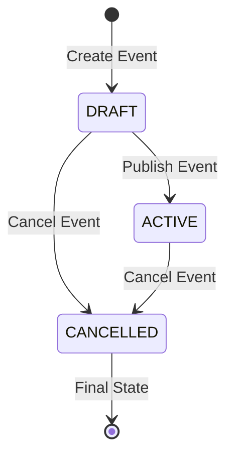

# Events Service

The Events Service is a Spring Boot-based microservice responsible for managing event lifecycle, including creation, publication, cancellation, and querying within the Ticketer application.

## Overview

This service handles comprehensive event management operations including event creation by organizers, publishing events to make them available for booking, event status management, and integration with notification services. It serves as the core event catalog for the entire Ticketer ecosystem.

## Features

- **Event Creation**: Organizers can create new events with detailed information
- **Event Lifecycle Management**: Draft → Published → Cancelled state transitions
- **Event Publishing**: Make events available for public booking
- **Event Querying**: Public and organizer-specific event retrieval
- **Status Management**: Handle event states (DRAFT, ACTIVE, CANCELLED)
- **Messaging Integration**: RabbitMQ integration for event notifications
- **Security**: JWT-based authentication with role-based access control
- **API Documentation**: Integrated Swagger/OpenAPI documentation
- **Health Monitoring**: Spring Boot Actuator with Prometheus metrics

## Technology Stack

- **Framework**: Spring Boot 3.1.4
- **Language**: Java 21
- **Database**: PostgreSQL
- **Messaging**: RabbitMQ (Spring AMQP)
- **Security**: Spring Security + JWT (JJWT 0.11.5)
- **Documentation**: SpringDoc OpenAPI
- **Build Tool**: Maven
- **Monitoring**: Micrometer + Prometheus

## API Endpoints

### Public Event Endpoints (`/api/v1/events`)

| Method | Endpoint | Description | Parameters | Response |
|--------|----------|-------------|------------|----------|
| `GET` | `/` | List published events | `category`, `from`, `to`, `q` | `Page<EventResponse>` |
| `GET` | `/{id}` | Get published event by ID | `id` | `EventResponse` |
| `GET` | `/all` | Get all published events | - | `ContentResponse<List<EventResponse>>` |

### Organizer Event Endpoints (`/api/v1/organizer/events`) - *Requires ORGANIZER role*

| Method | Endpoint | Description | Request Body | Response |
|--------|----------|-------------|--------------|----------|
| `POST` | `/add` | Create new event | `EventRequest` | `ContentResponse<Event>` |
| `PUT` | `/{id}` | Update event | `EventUpdateRequest` | `ContentResponse<Event>` |
| `PUT` | `/publish/{id}` | Publish event | - | `ContentResponse<Void>` |
| `PUT` | `/cancel/{id}` | Cancel event | - | `ContentResponse<Void>` |
| `GET` | `/` | List all organizer events | - | `ContentResponse<List<EventResponse>>` |
| `GET` | `/{id}` | Get event by ID (any status) | `id` | `ContentResponse<EventResponse>` |

## Data Models

### Request Models

**EventRequest**
```json
{
  "eventName": "string",
  "description": "string",
  "category": "string",
  "location": "string",
  "eventDate": "2024-01-01T00:00:00",
  "startTime": "10:00:00",
  "endTime": "18:00:00",
  "ticketCapacity": 1000,
  "ticketPrice": 25.99,
  "organizer": "string"
}
```

**EventUpdateRequest**
```json
{
  "eventName": "string",
  "description": "string",
  "category": "string",
  "location": "string",
  "eventDate": "2024-01-01T00:00:00",
  "startTime": "10:00:00",
  "endTime": "18:00:00",
  "ticketCapacity": 1000,
  "ticketPrice": 25.99
}
```

### Response Models

**EventResponse**
```json
{
  "id": 1,
  "eventName": "string",
  "description": "string",
  "category": "string",
  "location": "string",
  "eventDate": "2024-01-01T00:00:00",
  "startTime": "10:00:00",
  "endTime": "18:00:00",
  "ticketCapacity": 1000,
  "ticketPrice": 25.99,
  "organizer": "string",
  "status": "ACTIVE",
  "createdAt": "2024-01-01T00:00:00",
  "updatedAt": "2024-01-01T00:00:00"
}
```

**ContentResponse<T>**
```json
{
  "title": "string",
  "content": "T",
  "status": "success|error",
  "code": "200",
  "notificationStatus": "success|failure",
  "message": "string"
}
```

## Event Status Lifecycle



### Status Descriptions
- **DRAFT**: Event created but not yet published/available for booking
- **ACTIVE**: Event published and available for public booking
- **CANCELLED**: Event cancelled, no longer available

## Configuration

### Environment Variables

| Variable | Description | Default |
|----------|-------------|---------|
| `SPRING_DATASOURCE_URL` | PostgreSQL connection URL | `jdbc:postgresql://localhost:5432/events_db` |
| `SPRING_DATASOURCE_USERNAME` | Database username | `postgres` |
| `SPRING_DATASOURCE_PASSWORD` | Database password | `postgres` |
| `SPRING_JPA_HIBERNATE_DDL_AUTO` | Hibernate DDL mode | `update` |
| `SPRING_RABBITMQ_HOST` | RabbitMQ host | `localhost` |
| `SPRING_RABBITMQ_USERNAME` | RabbitMQ username | `guest` |
| `SPRING_RABBITMQ_PASSWORD` | RabbitMQ password | `guest` |
| `JWT_SECRET` | JWT signing secret | Auto-generated |

### Application Ports

- **HTTP Port**: 4041
- **Database Port**: 5432 (external: 5433)

## Getting Started

### Prerequisites

- Java 21+
- Maven 3.6+
- PostgreSQL 15+
- RabbitMQ 3.x
- Docker (optional)

### Local Development

1. **Clone the repository**
```bash
git clone <repository-url>
cd services/events-service
```

2. **Start Dependencies**
```bash
# PostgreSQL
docker run --name events-db \
  -e POSTGRES_DB=events_db \
  -e POSTGRES_USER=postgres \
  -e POSTGRES_PASSWORD=postgres \
  -p 5433:5432 \
  -d postgres:15

# RabbitMQ
docker run --name rabbitmq \
  -e RABBITMQ_DEFAULT_USER=guest \
  -e RABBITMQ_DEFAULT_PASS=guest \
  -p 5672:5672 \
  -p 15672:15672 \
  -d rabbitmq:3-management
```

3. **Run the application**
```bash
# Using Maven
mvn spring-boot:run

# Or build and run
mvn clean package
java -jar target/events-service-1.0-SNAPSHOT.jar
```

4. **Access the API**
- **API Base URL**: http://localhost:4041
- **Swagger UI**: http://localhost:4041/swagger-ui.html
- **OpenAPI Spec**: http://localhost:4041/v3/api-docs
- **Health Check**: http://localhost:4041/actuator/health
- **Metrics**: http://localhost:4041/actuator/prometheus

### Docker Deployment

1. **Build Docker image**
```bash
docker build -t ticketer/events-service .
```

2. **Run with Docker Compose**
```bash
# From the service directory
docker compose up

# Or from the root directory
docker compose up events-service
```

## Database Schema

### Events Table
- `id` (Primary Key, Auto-increment)
- `event_name` (Varchar, Not Null)
- `description` (Text)
- `category` (Varchar)
- `location` (Varchar)
- `event_date` (Date)
- `start_time` (Time)
- `end_time` (Time)
- `ticket_capacity` (Integer)
- `ticket_price` (Decimal)
- `organizer` (Varchar)
- `status` (Enum: DRAFT, ACTIVE, CANCELLED)
- `created_at` (Timestamp)
- `updated_at` (Timestamp)

## Messaging Integration

The service publishes events to RabbitMQ for integration with other services:

### Published Messages

| Event | Routing Key | Payload | Consumers |
|-------|-------------|---------|-----------|
| Event Created | `event.created` | `EventCreated` | Notification Service |
| Event Updated | `event.updated` | `EventCreated` | Notification Service |
| Event Published | `event.published` | `EventCreated` | Notification Service, Ticket Service |
| Event Cancelled | `event.deleted` | `EventCreated` | Notification Service, Ticket Service |

**EventCreated Message**
```json
{
  "eventId": 1,
  "eventName": "string",
  "userEmail": "organizer@example.com",
  "numberOfTickets": 1000
}
```

## Security

### Authentication & Authorization
- **JWT Tokens**: Bearer token authentication
- **Role-based Access**: ORGANIZER role required for management endpoints
- **Public Access**: Event listing and details available publicly
- **User Validation**: Integration with Authentication Service

### Security Features
- **Input Validation**: Jakarta Bean Validation
- **SQL Injection Protection**: JPA/Hibernate parameterized queries
- **CORS**: Configurable cross-origin resource sharing

## API Examples

### List published events (Public)
```bash
curl -X GET "http://localhost:4041/api/v1/events?category=music&q=concert"
```

### Get published event by ID (Public)
```bash
curl -X GET "http://localhost:4041/api/v1/events/1"
```

### Create new event (Organizer)
```bash
curl -X POST http://localhost:4041/api/v1/organizer/events/add \
  -H "Authorization: Bearer <jwt-token>" \
  -H "Content-Type: application/json" \
  -d '{
    "eventName": "Summer Music Festival",
    "description": "A three-day outdoor music festival",
    "category": "Music",
    "location": "Central Park, NYC",
    "eventDate": "2024-07-15T00:00:00",
    "startTime": "12:00:00",
    "endTime": "23:00:00",
    "ticketCapacity": 5000,
    "ticketPrice": 89.99,
    "organizer": "Festival Productions"
  }'
```

### Publish event (Organizer)
```bash
curl -X PUT http://localhost:4041/api/v1/organizer/events/publish/1 \
  -H "Authorization: Bearer <jwt-token>"
```

### Cancel event (Organizer)
```bash
curl -X PUT http://localhost:4041/api/v1/organizer/events/cancel/1 \
  -H "Authorization: Bearer <jwt-token>"
```

## Integration with Other Services

### Service Dependencies
- **Authentication Service**: User validation and JWT token validation
- **Notification Service**: Event-related notifications via RabbitMQ
- **Ticket Service**: Event publication triggers ticket creation
- **Gateway API**: Routes event requests

### External APIs Called
- **Authentication Service**: `GET /api/v1/auth/exists` - Validate user existence

## Monitoring and Health

### Health Checks
- **Database**: PostgreSQL connection status
- **RabbitMQ**: Message broker connectivity
- **Application**: Spring Boot health indicators

### Metrics
- **JVM**: Memory, GC, threads
- **HTTP**: Request counts, response times
- **Database**: Connection pool, query performance
- **RabbitMQ**: Message publishing/consuming metrics

## Testing

```bash
# Run unit tests
mvn test

# Run integration tests
mvn integration-test

# Run all tests with coverage
mvn clean verify
```

## Development Notes

### Business Rules
1. Events start in DRAFT status when created
2. Only DRAFT events can be updated
3. Events can only be published once (DRAFT → ACTIVE)
4. Published events can be cancelled but not updated
5. Cancelled events cannot be reactivated

### Error Handling
- Comprehensive exception handling with proper HTTP status codes
- Detailed error messages in ContentResponse format
- Graceful handling of messaging failures

## Contributing

1. Follow Java coding standards and Spring Boot best practices
2. Add unit tests for new functionality
3. Update API documentation
4. Ensure database migrations are backward compatible
5. Test messaging integration thoroughly
6. Follow semantic versioning for releases

## Support

For issues and support:
- Check application logs: `docker logs events-service`
- Monitor health endpoint: `/actuator/health`
- Review metrics: `/actuator/prometheus`
- Check Swagger documentation: `/swagger-ui.html`
- Monitor RabbitMQ management UI: http://localhost:15672