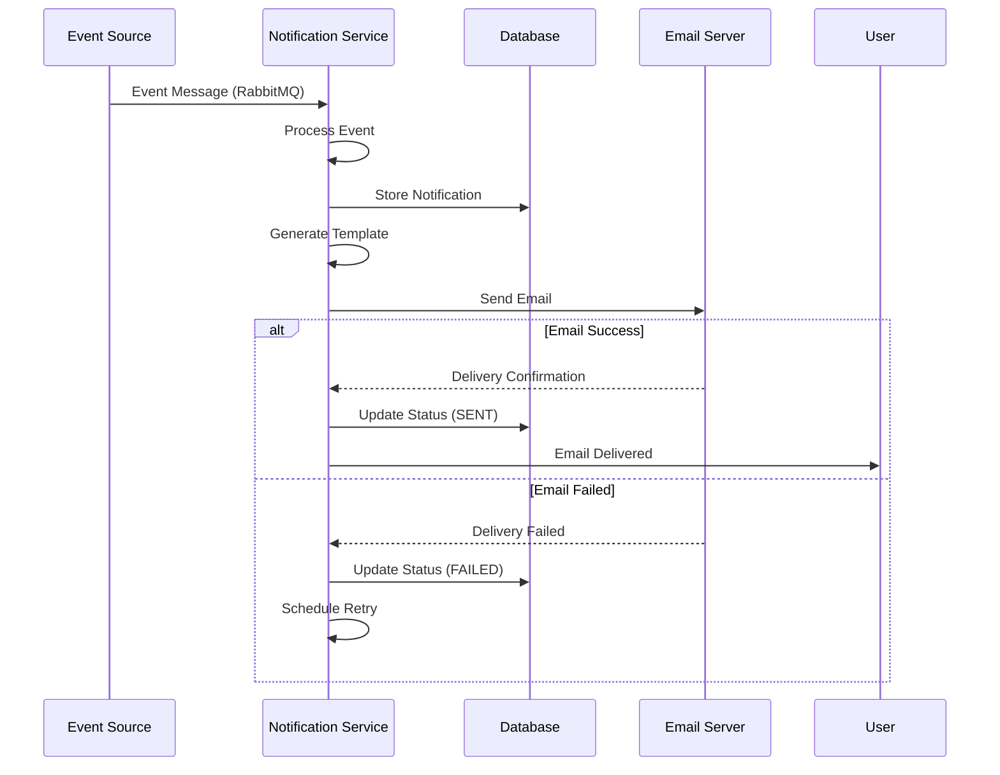
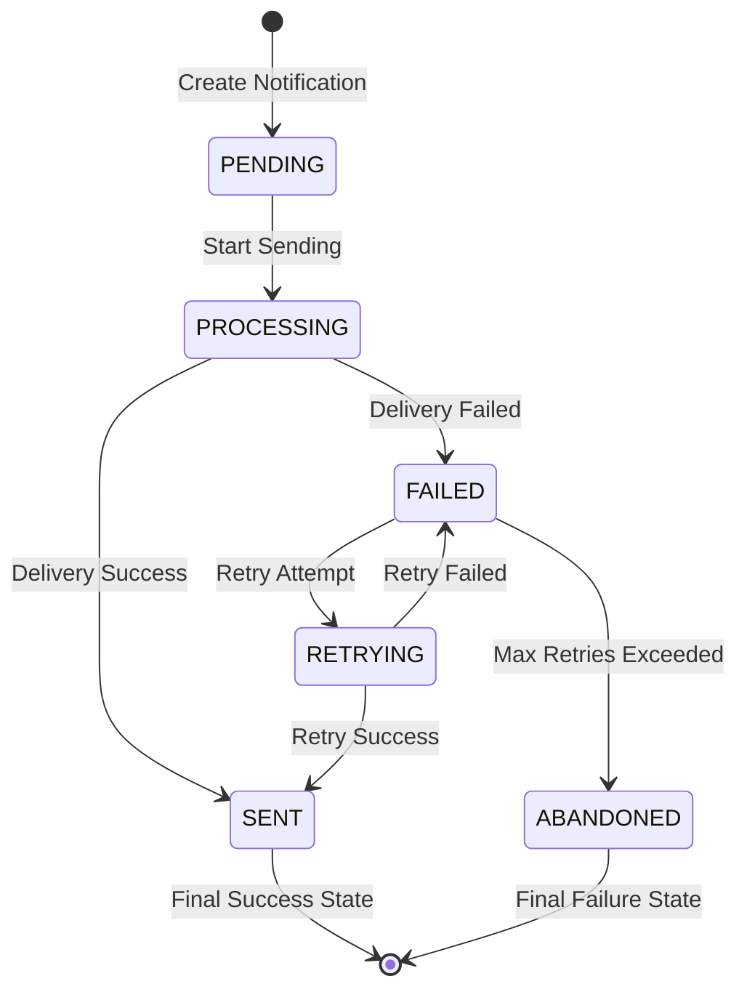

# Notification Service

The Notification Service is a Spring Boot-based microservice responsible for managing all notification operations, including email notifications, event-driven messaging, and communication with users within the Ticketer application.

## Overview

This service handles comprehensive notification management including email notifications for event-related activities, booking confirmations, payment status updates, and system alerts. It integrates with multiple messaging channels and provides reliable delivery mechanisms.

## Features

- **Email Notifications**: SMTP-based email delivery system
- **Event-Driven Messaging**: RabbitMQ integration for real-time notifications
- **Template Management**: Dynamic message template generation
- **Multi-Channel Support**: Email, SMS, push notifications (extensible)
- **Delivery Tracking**: Notification status and delivery confirmation
- **Batch Processing**: Bulk notification sending capabilities
- **Retry Mechanism**: Automatic retry for failed notifications
- **Health Monitoring**: Spring Boot Actuator with Prometheus metrics
- **API Documentation**: Comprehensive Swagger/OpenAPI documentation

## Technology Stack

- **Framework**: Spring Boot 3.1.4
- **Language**: Java 21
- **Database**: PostgreSQL
- **Messaging**: RabbitMQ (Spring AMQP)
- **Email**: Spring Boot Starter Mail
- **Documentation**: SpringDoc OpenAPI
- **Build Tool**: Maven
- **Monitoring**: Micrometer + Prometheus

## API Endpoints

### Notification Management (`/api/v1/notifications`)

| Method | Endpoint | Description | Request Body | Response |
|--------|----------|-------------|--------------|----------|
| `POST` | `/generate` | Send notification | `NotificationRequest` | `NotificationResponse` |

## Data Models

### Request Models

**NotificationRequest**
```json
{
  "recipient": "user@example.com",
  "messageSubject": "Booking Confirmation",
  "messageBody": "Your booking has been confirmed for Event XYZ."
}
```

### Response Models

**NotificationResponse**
```json
{
  "statusCode": 200,
  "message": "Notification sent successfully",
  "notification": {
    "id": 1,
    "recipient": "user@example.com",
    "subject": "Booking Confirmation",
    "body": "Your booking has been confirmed for Event XYZ.",
    "status": "SENT",
    "createdAt": "2024-01-01T00:00:00",
    "sentAt": "2024-01-01T00:00:30"
  }
}
```

## Event-Driven Notifications

The service automatically generates notifications based on various system events:

### Consumed Events

| Event | Source | Handler | Notification Type |
|-------|--------|---------|------------------|
| `EventCreated` | Events Service | EventListener | Event Creation Confirmation |
| `EventUpdated` | Events Service | EventListener | Event Update Notice |
| `EventPublished` | Events Service | EventListener | Event Publication Notice |
| `EventCancelled` | Events Service | EventListener | Event Cancellation Notice |
| `BookingCreated` | Booking Service | BookingListener | Booking Confirmation |
| `BookingConfirmed` | Booking Service | BookingListener | Booking Success |
| `BookingFailed` | Booking Service | BookingListener | Booking Failure Notice |
| `PaymentSucceeded` | Payment Service | PaymentListeners | Payment Confirmation |
| `PaymentFailed` | Payment Service | PaymentListeners | Payment Failure Notice |

## Notification Flow



## Configuration

### Environment Variables

| Variable | Description | Default |
|----------|-------------|---------|
| `SPRING_DATASOURCE_URL` | PostgreSQL connection URL | `jdbc:postgresql://localhost:5432/notification_db` |
| `SPRING_DATASOURCE_USERNAME` | Database username | `postgres` |
| `SPRING_DATASOURCE_PASSWORD` | Database password | `postgres` |
| `SPRING_JPA_HIBERNATE_DDL_AUTO` | Hibernate DDL mode | `update` |
| `SPRING_RABBITMQ_HOST` | RabbitMQ host | `localhost` |
| `SPRING_RABBITMQ_USERNAME` | RabbitMQ username | `guest` |
| `SPRING_RABBITMQ_PASSWORD` | RabbitMQ password | `guest` |
| `SPRING_MAIL_HOST` | SMTP server hostname | Required |
| `SPRING_MAIL_PORT` | SMTP server port | `587` |
| `SPRING_MAIL_USERNAME` | SMTP username | Required |
| `SPRING_MAIL_PASSWORD` | SMTP password | Required |
| `SPRING_MAIL_PROPERTIES_MAIL_SMTP_AUTH` | SMTP authentication | `true` |
| `SPRING_MAIL_PROPERTIES_MAIL_SMTP_STARTTLS_ENABLE` | SMTP TLS | `true` |

### Application Ports

- **HTTP Port**: 4042
- **Database Port**: 5432 (external: 5437)

## Getting Started

### Prerequisites

- Java 21+
- Maven 3.6+
- PostgreSQL 15+
- RabbitMQ 3.x
- SMTP Server (Gmail, SendGrid, etc.)
- Docker (optional)

### Local Development

1. **Clone the repository**
```bash
git clone <repository-url>
cd services/notification-service
```

2. **Start Dependencies**
```bash
# PostgreSQL
docker run --name notification-db \
  -e POSTGRES_DB=notification_db \
  -e POSTGRES_USER=postgres \
  -e POSTGRES_PASSWORD=postgres \
  -p 5437:5432 \
  -d postgres:15

# RabbitMQ
docker run --name rabbitmq \
  -e RABBITMQ_DEFAULT_USER=guest \
  -e RABBITMQ_DEFAULT_PASS=guest \
  -p 5672:5672 \
  -p 15672:15672 \
  -d rabbitmq:3-management
```

3. **Configure SMTP**
```properties
# application.properties
spring.mail.host=smtp.gmail.com
spring.mail.port=587
spring.mail.username=your-email@gmail.com
spring.mail.password=your-app-password
spring.mail.properties.mail.smtp.auth=true
spring.mail.properties.mail.smtp.starttls.enable=true
```

4. **Run the application**
```bash
# Using Maven
mvn spring-boot:run

# Or build and run
mvn clean package
java -jar target/notification-service-1.0-SNAPSHOT.jar
```

5. **Access the API**
- **API Base URL**: http://localhost:4042
- **Swagger UI**: http://localhost:4042/swagger-ui.html
- **OpenAPI Spec**: http://localhost:4042/v3/api-docs
- **Health Check**: http://localhost:4042/actuator/health
- **Metrics**: http://localhost:4042/actuator/prometheus

### Docker Deployment

1. **Build Docker image**
```bash
docker build -t ticketer/notification-service .
```

2. **Run with Docker Compose**
```bash
# From the service directory
docker compose up

# Or from the root directory
docker compose up notification-service
```

## Database Schema

### Notifications Table
```sql
CREATE TABLE notifications (
    id BIGSERIAL PRIMARY KEY,
    recipient VARCHAR(255) NOT NULL,
    subject VARCHAR(500),
    body TEXT,
    notification_type VARCHAR(50),
    status VARCHAR(20) DEFAULT 'PENDING',
    event_id BIGINT,
    booking_id UUID,
    created_at TIMESTAMP WITH TIME ZONE DEFAULT NOW(),
    sent_at TIMESTAMP WITH TIME ZONE,
    retry_count INTEGER DEFAULT 0,
    last_retry_at TIMESTAMP WITH TIME ZONE,
    error_message TEXT
);

-- Indexes for performance
CREATE INDEX idx_notifications_recipient ON notifications(recipient);
CREATE INDEX idx_notifications_status ON notifications(status);
CREATE INDEX idx_notifications_created_at ON notifications(created_at);
CREATE INDEX idx_notifications_event_id ON notifications(event_id);
```

### Notification Status Lifecycle



## Email Templates

The service supports dynamic email template generation:

### Template Types
- **Event Creation**: Welcome organizer, event created
- **Event Publication**: Event now live and available
- **Event Update**: Event details changed
- **Event Cancellation**: Event cancelled notice
- **Booking Confirmation**: Booking created successfully
- **Booking Success**: Payment completed, tickets confirmed
- **Booking Failure**: Booking or payment failed
- **Payment Confirmation**: Payment processed successfully
- **Payment Failure**: Payment declined or failed

### Template Variables
```java
Map<String, Object> templateVars = Map.of(
    "customerName", "John Doe",
    "eventName", "Summer Music Festival",
    "bookingId", "12345",
    "ticketQuantity", 2,
    "totalAmount", "$199.98",
    "eventDate", "2024-07-15",
    "eventLocation", "Central Park, NYC"
);
```

## Message Queue Integration

### Queue Configuration
```java
@RabbitListener(queues = "event.notifications")
public void handleEventNotification(EventNotification event) {
    // Process event and send notification
    processEventNotification(event);
}

@RabbitListener(queues = "booking.notifications")
public void handleBookingNotification(BookingNotification booking) {
    // Process booking and send notification
    processBookingNotification(booking);
}
```

### Message Routing
- **Event Notifications**: `event.created`, `event.updated`, `event.published`, `event.cancelled`
- **Booking Notifications**: `booking.created`, `booking.confirmed`, `booking.failed`
- **Payment Notifications**: `payment.succeeded`, `payment.failed`

## Error Handling and Retry Logic

### Retry Strategy
```java
@Retryable(
    value = {MessagingException.class}, 
    maxAttempts = 3, 
    backoff = @Backoff(delay = 2000, multiplier = 2)
)
public void sendEmailWithRetry(NotificationRequest request) {
    // Email sending logic
}
```

### Retry Configuration
- **Max Retries**: 3 attempts
- **Backoff**: Exponential (2s, 4s, 8s)
- **Dead Letter Queue**: Failed messages after max retries

## API Examples

### Send direct notification
```bash
curl -X POST http://localhost:4042/api/v1/notifications/generate \
  -H "Content-Type: application/json" \
  -d '{
    "recipient": "user@example.com",
    "messageSubject": "Welcome to Ticketer",
    "messageBody": "Thank you for joining our platform!"
  }'
```

### Response example
```json
{
  "statusCode": 200,
  "message": "Notification sent successfully",
  "notification": {
    "id": 1,
    "recipient": "user@example.com",
    "subject": "Welcome to Ticketer",
    "body": "Thank you for joining our platform!",
    "status": "SENT",
    "createdAt": "2024-01-01T12:00:00Z",
    "sentAt": "2024-01-01T12:00:15Z"
  }
}
```

## Integration with Other Services

### Service Dependencies
- **Events Service**: Event lifecycle notifications
- **Booking Service**: Booking status notifications  
- **Payment Service**: Payment confirmation notifications
- **SMTP Server**: Email delivery
- **RabbitMQ**: Event messaging

### Notification Triggers
1. **Event Created**: Welcome organizer
2. **Event Published**: Notify interested users
3. **Booking Created**: Booking confirmation
4. **Payment Succeeded**: Payment receipt
5. **Payment Failed**: Payment failure notice
6. **Event Cancelled**: Cancellation notice

## Monitoring and Health

### Health Checks
- **Database**: PostgreSQL connection status
- **SMTP**: Email server connectivity
- **RabbitMQ**: Message broker connectivity
- **Application**: Spring Boot health indicators

### Metrics
- **Notification Metrics**:
  - Send rate and success rate
  - Delivery time and failure rate
  - Queue size and processing time
- **Business Metrics**:
  - Notifications by type
  - User engagement rates
  - Delivery success by channel

### Logging
- **Structured Logging**: JSON format with correlation IDs
- **Delivery Tracking**: Complete notification audit trail
- **Error Tracking**: Failed delivery analysis
- **Performance Monitoring**: Processing time metrics

## Testing

```bash
# Run unit tests
mvn test

# Run integration tests
mvn integration-test

# Run with coverage
mvn clean verify
```

## Security Considerations

- **SMTP Security**: TLS encryption for email transmission
- **Data Privacy**: No sensitive data in notification logs
- **Rate Limiting**: Prevent spam and abuse
- **Input Validation**: Sanitize notification content
- **Authentication**: Secure SMTP credentials

## Performance Optimization

### Batch Processing
- **Bulk Email**: Send multiple notifications in batches
- **Queue Management**: Efficient message processing
- **Connection Pooling**: SMTP connection optimization
- **Template Caching**: Cache compiled templates

### Scaling Strategies
- **Horizontal Scaling**: Multiple service instances
- **Queue Partitioning**: Distribute message load
- **Database Optimization**: Indexed queries
- **Async Processing**: Non-blocking operations

## Contributing

1. Follow Java coding standards and Spring Boot best practices
2. Add unit tests for new notification types
3. Update template documentation
4. Test email delivery thoroughly
5. Ensure proper error handling and logging
6. Monitor performance impact of changes

## Support

For issues and support:
- Check application logs: `docker logs notification-service`
- Monitor health endpoint: `/actuator/health`
- Review metrics: `/actuator/prometheus`
- Check SMTP server status
- Monitor RabbitMQ queues: http://localhost:15672
- Review notification delivery reports